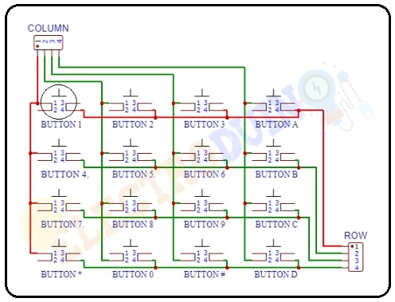

# RISCV based display controller

### RISCV GNU tool chain

RISCV GNU tool chain is a C & C++ cross compiler. It has two modes: ELF/Newlib toolchain and Linux-ELF/glibc toolchain. We are using ELF/Newlib toolchain.

We are building a custom RISCV based application core for a specific application for 32 bit processor. 

Following are tools required to compile & execute the application:

1. RISCV GNU toolchain with dependent libraries as specified in [RISCV-GNU-Toolchain](https://github.com/riscv-collab/riscv-gnu-toolchain).

2. Spike simulator - Spike is a functional RISC-V ISA simulator that implements a functional model of one or more RISC-V harts. [RISCV-SPIKE](https://github.com/riscv-software-src/riscv-isa-sim.git).

### RISCV 32 bit compiler installation.

```
sudo apt install libc6-dev
git clone https://github.com/riscv/riscv-gnu-toolchain --recursive
mkdir riscv32-toolchain
cd riscv-gnu-toolchain
./configure --prefix=/home/bhargav/riscv32-toolchain/ --with-arch=rv32i --with-abi=ilp32
sudo apt-get install libgmp-dev
make
```

Access the riscv32-unknown-elf-gcc inside bin folder of riscv32-toolchain folder in home folder of user as shown.

```
/home/bhargav/riscv32-toolchain/bin/riscv32-unknown-elf-gcc --version
```


### Display controller

Digital display boards, often referred to as electronic display boards, are devices used to visually convey information, data, or messages digitally. They are versatile tools employed in various settings for displaying a wide range of content. In this scenario, we are developing simple display board where it display board contains 3 7-segment modules and a keypad matrix. The system accepts input from keypad matrix to accept message and displays the scrolling text.

### Block diagram


### Functionality

The system has two important components: Keypad matrix and 7 segment display.The system has a push button (Display/Input mode) that tells whether it accept input from keypad matrix or continue displaying stored text. The system display each character at a time. Note that some letters such as K (K), M (M), V (V), W (W), X (X), and Z (Z) are completely unrecognizable by most people. We try to achieve simple scrolling effect. Shift each letter to left to accomodate entire message. After each word, all display modules is blank for sometime and again starts to display next part of message. For this project, we display only characters available in keypad. We can modify the code such that we can multiplex4 characters for each button of keypad and accomdate alphabets.

Delay circuit is a oscillator that produces square wave of period of 1.5s. With respect to this signal, the display changes the text. 555 timer circuit is used to produce a square signal of 1.5s . Since, clock frequency is unknown, we use 555 timer as reference as a absolute delay generation.


### Flowchart


### Register architecture of x30 for GPIOs:


x30[3:0] is row pins of keypad.

x30[7:4] is column pins of keypad.

x30[14:8] is 7 segment display pins.

x30[25] is mode_led to indicate input / display mode of system. LED is ON if input mode else OFF for display mode.

x30[27] is next input which is used as enter button to store each character we enter.

x30[29] is delay pin where it accepts signal from 555 timer.

x30[31] is input/display mode input pin.


### Binary codes for keypad 



For row wise scanning process, we should put values as follows and then read column pins to determine the button.

| Buttons | Row | Column |
| --- | --- | --- |
| 1 | Put 1110 | read 1110 |
| 2 | Put 1110 | read 1101 |
| 3 | Put 1110 | read 1011 |
| A | Put 1110 | read 0111 |
| 4 | Put 1101 | read 1110 |
| 5 | Put 1101 | read 1101 |
| 6 | Put 1101 | read 1011 |
| B | Put 1101 | read 0111 |
| 7 | Put 1011 | read 1110 |
| 8 | Put 1011 | read 1101 |
| 9 | Put 1011 | read 1011 |
| C | Put 1011 | read 0111 |
| - | Put 0111 | read 1110 |
| 0 | Put 0111 | read 1101 |
| - | Put 0111 | read 1011 |
| D | Put 0111 | read 0111 |


### 7 segment hex code

MSB in x30[14:8] is a and LSB in x30[14:8] is g segments in 7 segment display pins.

| Data | Binary code | 
| --- | --- |
| 1 | 0110000 |
| 2 | 1101101 |
| 3 | 1111001 |
| 4 | 0110011 |
| 5 | 1011011 |
| 6 | 1011110 |
| 7 | 1110000 |
| 8 | 1111111 |
| 9 | 1110011 |
| 0 | 0000000 |
| A | 1110111 |
| B | 0011111 |
| C | 1001110 |
| D | 0111101 |
| - | 0000001 |


### C program

```
unsigned char read_keypad(void);
void display1_output(unsigned char num);
void display_mode(unsigned char mode);

unsigned char read_next(void);
unsigned char read_mode(void);
unsigned char read_delay(void);


int main()
{
	unsigned char mode;
	unsigned char display1;
	unsigned char delay;
	unsigned char next;
	unsigned char keypad;
	unsigned char message[20]={};
	unsigned char count1=0;
	
	
	//initialize with hypen
	display1_output(1);
	
	
	while(1)
	{
		mode=read_mode();
		if(mode==1)//input new text
		{
			keypad=read_keypad();
			if(keypad!=-1)
			{
				message[count1]=keypad;
				if(keypad!=1)
				{
					count1++;
					display1_output(keypad);
					next=read_next();
					while(next==0);
				}
				else
				{
					count1=0;
				}
				
			}
		}
		else if(mode==0)//display stored text
		{
			delay=read_delay();
			if(delay==1)
			{
				//end of text
				if(message[count1]==1)
				{
					count1=0;
					continue;
				}				
				display1_output(message[count1]);
				count1++;
				
			}
		}
	}
	return(0);
}

unsigned char read_keypad(void)
{
	unsigned char keypad;
	unsigned char row[5]={14,13,11,7,0};
	unsigned char i=0;
	int mask=0xFFFFFF00;
	while(row[i]>0)
	{
		asm volatile(
		"and x30,x30,%1\n\t"
	    	"or x30, x30, %0\n\t"
	    	:
	    	:"r"(row[i]),"r"(mask)
	    	:"x30"
	    	);
	    	
	    	asm volatile(
	    	"andi %0, x30, 240\n\t"
	    	:"=r"(keypad)
	    	:
	    	:
	    	);
	    	if(keypad!=240)
	    	{
	    		//unsigned char pressed=1;
	    		break;
		}
		i++;
		
	}
	if(row[i]==0)//no button pressed
	{
		return -1;
	}
	else
	{
		if(row[i]==14)//row=1
		{
			if(keypad==224) keypad=48;//1
			else if(keypad==208) keypad=109;//2
			else if(keypad==176) keypad=121;//3
			else if(keypad==112) keypad=119;//A
		}
		else if(row[i]==13)//row=2
		{
			if(keypad==224) keypad=51;//4
			else if(keypad==208) keypad=91;//5
			else if(keypad==176) keypad=94;//6
			else if(keypad==112) keypad=31;//B
		}
		else if(row[i]==11)//row=3
		{
			if(keypad==224) keypad=112;//7
			else if(keypad==208) keypad=127;//8
			else if(keypad==176) keypad=115;//9
			else if(keypad==112) keypad=78;//C
		}
		else if(row[i]==7)//row=4
		{
			if(keypad==224) keypad=1;//-
			else if(keypad==208) keypad=126;//0
			else if(keypad==176) keypad=1;//-
			else if(keypad==112) keypad=61;//D
		}
	}
	
        
        return keypad;
}

unsigned char read_mode(void)
{
	unsigned char mode;//read whether controller is in display mode or input mode
	asm volatile(
	"srli x10, x30, 31\n\t"
	"andi %0, x10, 1\n\t"
	:"=r"(mode)
	:
        :"x10"
        );
        return mode;
}

void display1_output(unsigned char num)
{
	int mask=0xFFFF80FF;
	int temp=num*256;//shift by 8 bits to left to update display bits in x30
	asm volatile( 
	    "and x30, x30, %1\n\t"
	    "or x30, x30, %0\n\t"
	    :
	    :"r"(temp),"r"(mask)
	    :"x30"
	    );
}

void display_mode(unsigned char mode)//shift by 25 bits to left to update display mode led in x30
{
	int mask=0xFDFFFFFF;
	asm volatile(
	    "and x30, x30, %1\n\t"
	    "slli x10, %0, 25\n\t" 
	    "or x30, x30, x10\n\t"  
	    : 
	    :"r"(mode),"r"(mask)
	    :"x30","x10"
	    );
}

unsigned char read_delay(void)
{
	unsigned char delay;// read delay signal generated by external circuit 
	asm volatile(
	"srli x10, x30, 29\n\t"
	"andi %0, x10, 1\n\t"
        :"=r"(delay)
        :
        :"x10"
        );
        return delay;
}

unsigned char read_next(void)
{
	unsigned char next;// read next button to accpet next character of text.
	asm volatile(
	"srli x10, x30, 27\n\t"
	"andi %0, x10, 1\n\t"
        :"=r"(next)
        :
        :"x10"
        );
        return next;
}
```


### Assembly code

```
display_controller.out:     file format elf32-littleriscv


Disassembly of section .text:

00010054 <main>:
   10054:	fd010113          	addi	sp,sp,-48
   10058:	02112623          	sw	ra,44(sp)
   1005c:	02812423          	sw	s0,40(sp)
   10060:	03010413          	addi	s0,sp,48
   10064:	fc042a23          	sw	zero,-44(s0)
   10068:	fc042c23          	sw	zero,-40(s0)
   1006c:	fc042e23          	sw	zero,-36(s0)
   10070:	fe042023          	sw	zero,-32(s0)
   10074:	fe042223          	sw	zero,-28(s0)
   10078:	fe0407a3          	sb	zero,-17(s0)
   1007c:	00100513          	li	a0,1
   10080:	3ac000ef          	jal	ra,1042c <display1_output>
   10084:	37c000ef          	jal	ra,10400 <read_mode>
   10088:	00050793          	mv	a5,a0
   1008c:	fef40723          	sb	a5,-18(s0)
   10090:	fee44703          	lbu	a4,-18(s0)
   10094:	00100793          	li	a5,1
   10098:	06f71463          	bne	a4,a5,10100 <main+0xac>
   1009c:	0cc000ef          	jal	ra,10168 <read_keypad>
   100a0:	00050793          	mv	a5,a0
   100a4:	fef406a3          	sb	a5,-19(s0)
   100a8:	fef44783          	lbu	a5,-17(s0)
   100ac:	ff040713          	addi	a4,s0,-16
   100b0:	00f707b3          	add	a5,a4,a5
   100b4:	fed44703          	lbu	a4,-19(s0)
   100b8:	fee78223          	sb	a4,-28(a5)
   100bc:	fed44703          	lbu	a4,-19(s0)
   100c0:	00100793          	li	a5,1
   100c4:	02f70a63          	beq	a4,a5,100f8 <main+0xa4>
   100c8:	fef44783          	lbu	a5,-17(s0)
   100cc:	00178793          	addi	a5,a5,1
   100d0:	fef407a3          	sb	a5,-17(s0)
   100d4:	fed44783          	lbu	a5,-19(s0)
   100d8:	00078513          	mv	a0,a5
   100dc:	350000ef          	jal	ra,1042c <display1_output>
   100e0:	408000ef          	jal	ra,104e8 <read_next>
   100e4:	00050793          	mv	a5,a0
   100e8:	fef40623          	sb	a5,-20(s0)
   100ec:	fec44783          	lbu	a5,-20(s0)
   100f0:	fe078ee3          	beqz	a5,100ec <main+0x98>
   100f4:	f91ff06f          	j	10084 <main+0x30>
   100f8:	fe0407a3          	sb	zero,-17(s0)
   100fc:	f89ff06f          	j	10084 <main+0x30>
   10100:	fee44783          	lbu	a5,-18(s0)
   10104:	f80790e3          	bnez	a5,10084 <main+0x30>
   10108:	3b4000ef          	jal	ra,104bc <read_delay>
   1010c:	00050793          	mv	a5,a0
   10110:	fef405a3          	sb	a5,-21(s0)
   10114:	feb44703          	lbu	a4,-21(s0)
   10118:	00100793          	li	a5,1
   1011c:	f6f714e3          	bne	a4,a5,10084 <main+0x30>
   10120:	fef44783          	lbu	a5,-17(s0)
   10124:	ff040713          	addi	a4,s0,-16
   10128:	00f707b3          	add	a5,a4,a5
   1012c:	fe47c703          	lbu	a4,-28(a5)
   10130:	00100793          	li	a5,1
   10134:	00f71663          	bne	a4,a5,10140 <main+0xec>
   10138:	fe0407a3          	sb	zero,-17(s0)
   1013c:	0280006f          	j	10164 <main+0x110>
   10140:	fef44783          	lbu	a5,-17(s0)
   10144:	ff040713          	addi	a4,s0,-16
   10148:	00f707b3          	add	a5,a4,a5
   1014c:	fe47c783          	lbu	a5,-28(a5)
   10150:	00078513          	mv	a0,a5
   10154:	2d8000ef          	jal	ra,1042c <display1_output>
   10158:	fef44783          	lbu	a5,-17(s0)
   1015c:	00178793          	addi	a5,a5,1
   10160:	fef407a3          	sb	a5,-17(s0)
   10164:	f21ff06f          	j	10084 <main+0x30>

00010168 <read_keypad>:
   10168:	fe010113          	addi	sp,sp,-32
   1016c:	00812e23          	sw	s0,28(sp)
   10170:	02010413          	addi	s0,sp,32
   10174:	000117b7          	lui	a5,0x11
   10178:	51478793          	addi	a5,a5,1300 # 11514 <__DATA_BEGIN__>
   1017c:	0007a703          	lw	a4,0(a5)
   10180:	fee42023          	sw	a4,-32(s0)
   10184:	0047c783          	lbu	a5,4(a5)
   10188:	fef40223          	sb	a5,-28(s0)
   1018c:	fe040723          	sb	zero,-18(s0)
   10190:	f0000793          	li	a5,-256
   10194:	fef42423          	sw	a5,-24(s0)
   10198:	0400006f          	j	101d8 <read_keypad+0x70>
   1019c:	fee44783          	lbu	a5,-18(s0)
   101a0:	ff040713          	addi	a4,s0,-16
   101a4:	00f707b3          	add	a5,a4,a5
   101a8:	ff07c783          	lbu	a5,-16(a5)
   101ac:	fe842703          	lw	a4,-24(s0)
   101b0:	00ef7f33          	and	t5,t5,a4
   101b4:	00ff6f33          	or	t5,t5,a5
   101b8:	0f0f7793          	andi	a5,t5,240
   101bc:	fef407a3          	sb	a5,-17(s0)
   101c0:	fef44703          	lbu	a4,-17(s0)
   101c4:	0f000793          	li	a5,240
   101c8:	02f71463          	bne	a4,a5,101f0 <read_keypad+0x88>
   101cc:	fee44783          	lbu	a5,-18(s0)
   101d0:	00178793          	addi	a5,a5,1
   101d4:	fef40723          	sb	a5,-18(s0)
   101d8:	fee44783          	lbu	a5,-18(s0)
   101dc:	ff040713          	addi	a4,s0,-16
   101e0:	00f707b3          	add	a5,a4,a5
   101e4:	ff07c783          	lbu	a5,-16(a5)
   101e8:	fa079ae3          	bnez	a5,1019c <read_keypad+0x34>
   101ec:	0080006f          	j	101f4 <read_keypad+0x8c>
   101f0:	00000013          	nop
   101f4:	fee44783          	lbu	a5,-18(s0)
   101f8:	ff040713          	addi	a4,s0,-16
   101fc:	00f707b3          	add	a5,a4,a5
   10200:	ff07c783          	lbu	a5,-16(a5)
   10204:	00079663          	bnez	a5,10210 <read_keypad+0xa8>
   10208:	0ff00793          	li	a5,255
   1020c:	1e40006f          	j	103f0 <read_keypad+0x288>
   10210:	fee44783          	lbu	a5,-18(s0)
   10214:	ff040713          	addi	a4,s0,-16
   10218:	00f707b3          	add	a5,a4,a5
   1021c:	ff07c703          	lbu	a4,-16(a5)
   10220:	00e00793          	li	a5,14
   10224:	06f71263          	bne	a4,a5,10288 <read_keypad+0x120>
   10228:	fef44703          	lbu	a4,-17(s0)
   1022c:	0e000793          	li	a5,224
   10230:	00f71863          	bne	a4,a5,10240 <read_keypad+0xd8>
   10234:	03000793          	li	a5,48
   10238:	fef407a3          	sb	a5,-17(s0)
   1023c:	1b00006f          	j	103ec <read_keypad+0x284>
   10240:	fef44703          	lbu	a4,-17(s0)
   10244:	0d000793          	li	a5,208
   10248:	00f71863          	bne	a4,a5,10258 <read_keypad+0xf0>
   1024c:	06d00793          	li	a5,109
   10250:	fef407a3          	sb	a5,-17(s0)
   10254:	1980006f          	j	103ec <read_keypad+0x284>
   10258:	fef44703          	lbu	a4,-17(s0)
   1025c:	0b000793          	li	a5,176
   10260:	00f71863          	bne	a4,a5,10270 <read_keypad+0x108>
   10264:	07900793          	li	a5,121
   10268:	fef407a3          	sb	a5,-17(s0)
   1026c:	1800006f          	j	103ec <read_keypad+0x284>
   10270:	fef44703          	lbu	a4,-17(s0)
   10274:	07000793          	li	a5,112
   10278:	16f71a63          	bne	a4,a5,103ec <read_keypad+0x284>
   1027c:	07700793          	li	a5,119
   10280:	fef407a3          	sb	a5,-17(s0)
   10284:	1680006f          	j	103ec <read_keypad+0x284>
   10288:	fee44783          	lbu	a5,-18(s0)
   1028c:	ff040713          	addi	a4,s0,-16
   10290:	00f707b3          	add	a5,a4,a5
   10294:	ff07c703          	lbu	a4,-16(a5)
   10298:	00d00793          	li	a5,13
   1029c:	06f71263          	bne	a4,a5,10300 <read_keypad+0x198>
   102a0:	fef44703          	lbu	a4,-17(s0)
   102a4:	0e000793          	li	a5,224
   102a8:	00f71863          	bne	a4,a5,102b8 <read_keypad+0x150>
   102ac:	03300793          	li	a5,51
   102b0:	fef407a3          	sb	a5,-17(s0)
   102b4:	1380006f          	j	103ec <read_keypad+0x284>
   102b8:	fef44703          	lbu	a4,-17(s0)
   102bc:	0d000793          	li	a5,208
   102c0:	00f71863          	bne	a4,a5,102d0 <read_keypad+0x168>
   102c4:	05b00793          	li	a5,91
   102c8:	fef407a3          	sb	a5,-17(s0)
   102cc:	1200006f          	j	103ec <read_keypad+0x284>
   102d0:	fef44703          	lbu	a4,-17(s0)
   102d4:	0b000793          	li	a5,176
   102d8:	00f71863          	bne	a4,a5,102e8 <read_keypad+0x180>
   102dc:	05e00793          	li	a5,94
   102e0:	fef407a3          	sb	a5,-17(s0)
   102e4:	1080006f          	j	103ec <read_keypad+0x284>
   102e8:	fef44703          	lbu	a4,-17(s0)
   102ec:	07000793          	li	a5,112
   102f0:	0ef71e63          	bne	a4,a5,103ec <read_keypad+0x284>
   102f4:	01f00793          	li	a5,31
   102f8:	fef407a3          	sb	a5,-17(s0)
   102fc:	0f00006f          	j	103ec <read_keypad+0x284>
   10300:	fee44783          	lbu	a5,-18(s0)
   10304:	ff040713          	addi	a4,s0,-16
   10308:	00f707b3          	add	a5,a4,a5
   1030c:	ff07c703          	lbu	a4,-16(a5)
   10310:	00b00793          	li	a5,11
   10314:	06f71263          	bne	a4,a5,10378 <read_keypad+0x210>
   10318:	fef44703          	lbu	a4,-17(s0)
   1031c:	0e000793          	li	a5,224
   10320:	00f71863          	bne	a4,a5,10330 <read_keypad+0x1c8>
   10324:	07000793          	li	a5,112
   10328:	fef407a3          	sb	a5,-17(s0)
   1032c:	0c00006f          	j	103ec <read_keypad+0x284>
   10330:	fef44703          	lbu	a4,-17(s0)
   10334:	0d000793          	li	a5,208
   10338:	00f71863          	bne	a4,a5,10348 <read_keypad+0x1e0>
   1033c:	07f00793          	li	a5,127
   10340:	fef407a3          	sb	a5,-17(s0)
   10344:	0a80006f          	j	103ec <read_keypad+0x284>
   10348:	fef44703          	lbu	a4,-17(s0)
   1034c:	0b000793          	li	a5,176
   10350:	00f71863          	bne	a4,a5,10360 <read_keypad+0x1f8>
   10354:	07300793          	li	a5,115
   10358:	fef407a3          	sb	a5,-17(s0)
   1035c:	0900006f          	j	103ec <read_keypad+0x284>
   10360:	fef44703          	lbu	a4,-17(s0)
   10364:	07000793          	li	a5,112
   10368:	08f71263          	bne	a4,a5,103ec <read_keypad+0x284>
   1036c:	04e00793          	li	a5,78
   10370:	fef407a3          	sb	a5,-17(s0)
   10374:	0780006f          	j	103ec <read_keypad+0x284>
   10378:	fee44783          	lbu	a5,-18(s0)
   1037c:	ff040713          	addi	a4,s0,-16
   10380:	00f707b3          	add	a5,a4,a5
   10384:	ff07c703          	lbu	a4,-16(a5)
   10388:	00700793          	li	a5,7
   1038c:	06f71063          	bne	a4,a5,103ec <read_keypad+0x284>
   10390:	fef44703          	lbu	a4,-17(s0)
   10394:	0e000793          	li	a5,224
   10398:	00f71863          	bne	a4,a5,103a8 <read_keypad+0x240>
   1039c:	00100793          	li	a5,1
   103a0:	fef407a3          	sb	a5,-17(s0)
   103a4:	0480006f          	j	103ec <read_keypad+0x284>
   103a8:	fef44703          	lbu	a4,-17(s0)
   103ac:	0d000793          	li	a5,208
   103b0:	00f71863          	bne	a4,a5,103c0 <read_keypad+0x258>
   103b4:	07f00793          	li	a5,127
   103b8:	fef407a3          	sb	a5,-17(s0)
   103bc:	0300006f          	j	103ec <read_keypad+0x284>
   103c0:	fef44703          	lbu	a4,-17(s0)
   103c4:	0b000793          	li	a5,176
   103c8:	00f71863          	bne	a4,a5,103d8 <read_keypad+0x270>
   103cc:	00100793          	li	a5,1
   103d0:	fef407a3          	sb	a5,-17(s0)
   103d4:	0180006f          	j	103ec <read_keypad+0x284>
   103d8:	fef44703          	lbu	a4,-17(s0)
   103dc:	07000793          	li	a5,112
   103e0:	00f71663          	bne	a4,a5,103ec <read_keypad+0x284>
   103e4:	03d00793          	li	a5,61
   103e8:	fef407a3          	sb	a5,-17(s0)
   103ec:	fef44783          	lbu	a5,-17(s0)
   103f0:	00078513          	mv	a0,a5
   103f4:	01c12403          	lw	s0,28(sp)
   103f8:	02010113          	addi	sp,sp,32
   103fc:	00008067          	ret

00010400 <read_mode>:
   10400:	fe010113          	addi	sp,sp,-32
   10404:	00812e23          	sw	s0,28(sp)
   10408:	02010413          	addi	s0,sp,32
   1040c:	01ff5513          	srli	a0,t5,0x1f
   10410:	00157793          	andi	a5,a0,1
   10414:	fef407a3          	sb	a5,-17(s0)
   10418:	fef44783          	lbu	a5,-17(s0)
   1041c:	00078513          	mv	a0,a5
   10420:	01c12403          	lw	s0,28(sp)
   10424:	02010113          	addi	sp,sp,32
   10428:	00008067          	ret

0001042c <display1_output>:
   1042c:	fd010113          	addi	sp,sp,-48
   10430:	02812623          	sw	s0,44(sp)
   10434:	03010413          	addi	s0,sp,48
   10438:	00050793          	mv	a5,a0
   1043c:	fcf40fa3          	sb	a5,-33(s0)
   10440:	ffff87b7          	lui	a5,0xffff8
   10444:	0ff78793          	addi	a5,a5,255 # ffff80ff <__global_pointer$+0xfffe63eb>
   10448:	fef42623          	sw	a5,-20(s0)
   1044c:	fdf44783          	lbu	a5,-33(s0)
   10450:	00879793          	slli	a5,a5,0x8
   10454:	fef42423          	sw	a5,-24(s0)
   10458:	fe842783          	lw	a5,-24(s0)
   1045c:	fec42703          	lw	a4,-20(s0)
   10460:	00ef7f33          	and	t5,t5,a4
   10464:	00ff6f33          	or	t5,t5,a5
   10468:	00000013          	nop
   1046c:	02c12403          	lw	s0,44(sp)
   10470:	03010113          	addi	sp,sp,48
   10474:	00008067          	ret

00010478 <display_mode>:
   10478:	fd010113          	addi	sp,sp,-48
   1047c:	02812623          	sw	s0,44(sp)
   10480:	03010413          	addi	s0,sp,48
   10484:	00050793          	mv	a5,a0
   10488:	fcf40fa3          	sb	a5,-33(s0)
   1048c:	fe0007b7          	lui	a5,0xfe000
   10490:	fff78793          	addi	a5,a5,-1 # fdffffff <__global_pointer$+0xfdfee2eb>
   10494:	fef42623          	sw	a5,-20(s0)
   10498:	fdf44783          	lbu	a5,-33(s0)
   1049c:	fec42703          	lw	a4,-20(s0)
   104a0:	00ef7f33          	and	t5,t5,a4
   104a4:	01979513          	slli	a0,a5,0x19
   104a8:	00af6f33          	or	t5,t5,a0
   104ac:	00000013          	nop
   104b0:	02c12403          	lw	s0,44(sp)
   104b4:	03010113          	addi	sp,sp,48
   104b8:	00008067          	ret

000104bc <read_delay>:
   104bc:	fe010113          	addi	sp,sp,-32
   104c0:	00812e23          	sw	s0,28(sp)
   104c4:	02010413          	addi	s0,sp,32
   104c8:	01df5513          	srli	a0,t5,0x1d
   104cc:	00157793          	andi	a5,a0,1
   104d0:	fef407a3          	sb	a5,-17(s0)
   104d4:	fef44783          	lbu	a5,-17(s0)
   104d8:	00078513          	mv	a0,a5
   104dc:	01c12403          	lw	s0,28(sp)
   104e0:	02010113          	addi	sp,sp,32
   104e4:	00008067          	ret

000104e8 <read_next>:
   104e8:	fe010113          	addi	sp,sp,-32
   104ec:	00812e23          	sw	s0,28(sp)
   104f0:	02010413          	addi	s0,sp,32
   104f4:	01bf5513          	srli	a0,t5,0x1b
   104f8:	00157793          	andi	a5,a0,1
   104fc:	fef407a3          	sb	a5,-17(s0)
   10500:	fef44783          	lbu	a5,-17(s0)
   10504:	00078513          	mv	a0,a5
   10508:	01c12403          	lw	s0,28(sp)
   1050c:	02010113          	addi	sp,sp,32
   10510:	00008067          	ret
 ```
 
 ### Unique instrcutions in assembly code
 
 We use python script to count the unique instructions used in this application.
 
 ```
Number of different instructions: 22
List of unique instructions:
slli
sw
and
addi
sb
lw
nop
bne
lui
j
beq
andi
srli
lbu
jal
add
beqz
bnez
mv
li
ret
or
 ```
 
 ### References
 
1. https://github.com/SakethGajawada/RISCV_GNU
 
2. https://circuitdigest.com/microcontroller-projects/keypad-interfacing-with-8051-microcontroller
 
3. https://www.circuitstoday.com/interfacing-seven-segment-display-to-8051

4. https://github.com/riscv-collab/riscv-gnu-toolchain

