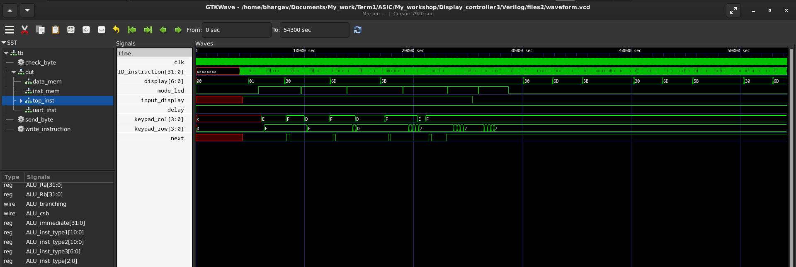
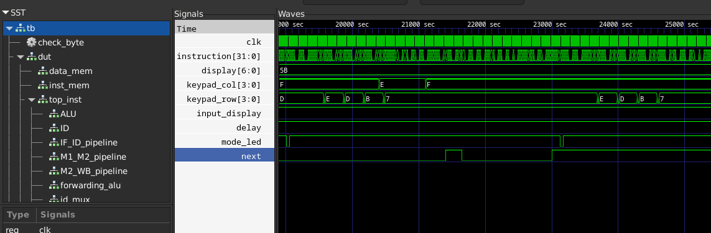
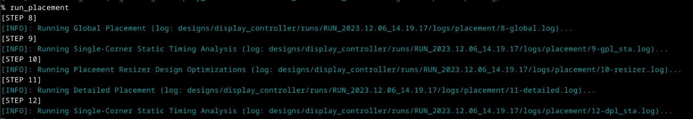
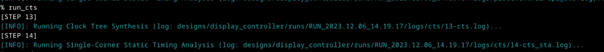
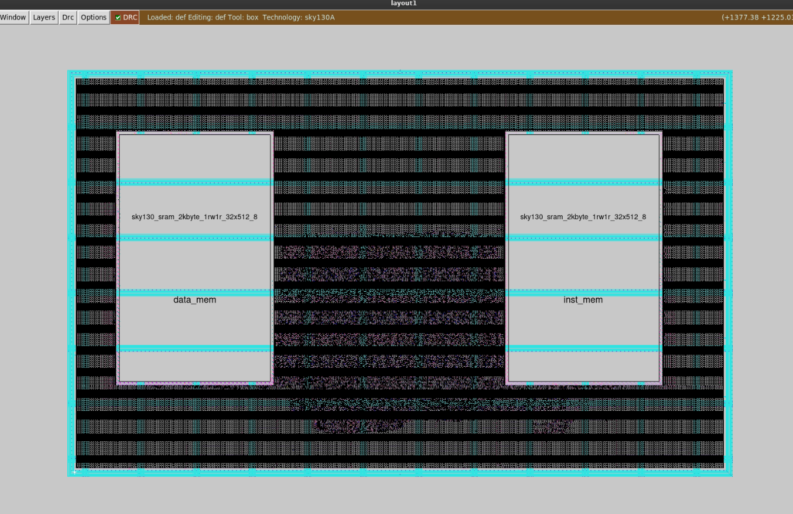
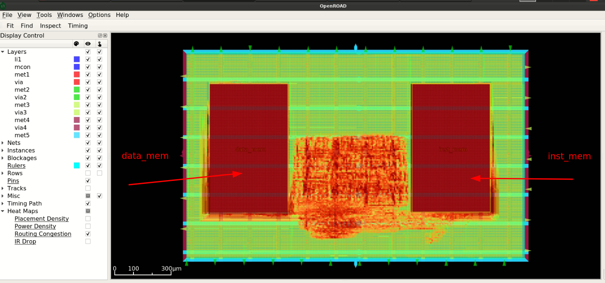

# RISCV based display controller

<details>
<summary>RISCV GNU tool chain</summary>

RISCV GNU tool chain is a C & C++ cross compiler. It has two modes: ELF/Newlib toolchain and Linux-ELF/glibc toolchain. We are using ELF/Newlib toolchain.

We are building a custom RISCV based application core for a specific application for 32 bit processor. 

Following are tools required to compile & execute the application:

1. RISCV GNU toolchain with dependent libraries as specified in [RISCV-GNU-Toolchain](https://github.com/riscv-collab/riscv-gnu-toolchain).

2. Spike simulator - Spike is a functional RISC-V ISA simulator that implements a functional model of one or more RISC-V harts. [RISCV-SPIKE](https://github.com/riscv-software-src/riscv-isa-sim.git).

</details>

<details>
<summary>RISCV 32 bit compiler installation</summary>

```
sudo apt install libc6-dev
git clone https://github.com/riscv/riscv-gnu-toolchain --recursive
mkdir riscv32-toolchain
cd riscv-gnu-toolchain
./configure --prefix=/home/bhargav/riscv32-toolchain/ --with-arch=rv32i --with-abi=ilp32
sudo apt-get install libgmp-dev
make
```

Access the riscv32-unknown-elf-gcc inside bin folder of riscv32-toolchain folder in home folder of user as shown.

```
/home/bhargav/riscv32-toolchain/bin/riscv32-unknown-elf-gcc --version
```
</details>


<details>
<summary>Display controller</summary>

Digital display boards, often referred to as electronic display boards, are devices used to visually convey information, data, or messages digitally. They are versatile tools employed in various settings for displaying a wide range of content. In this scenario, we are developing simple display board where it display board contains 3 7-segment modules and a keypad matrix. The system accepts input from keypad matrix to accept message and displays the scrolling text.
</details>

<details>
<summary>Block diagram</summary>


</details>

<details>
<summary>Functionality</summary>

The system has two important components: Keypad matrix and 7 segment display.The system has a push button (Display/Input mode) that tells whether it accept input from keypad matrix or continue displaying stored text. The system display each character at a time. Note that some letters such as K (K), M (M), V (V), W (W), X (X), and Z (Z) are completely unrecognizable by most people. We try to achieve simple scrolling effect. Shift each letter to left to accomodate entire message. After each word, all display modules is blank for sometime and again starts to display next part of message. For this project, we display only characters available in keypad. We can modify the code such that we can multiplex4 characters for each button of keypad and accomdate alphabets.

Delay circuit is a oscillator that produces square wave of period of 1.5s. With respect to this signal, the display changes the text. 555 timer circuit is used to produce a square signal of 1.5s . Since, clock frequency is unknown, we use 555 timer as reference as a absolute delay generation.


</details>

<details>
<summary>Flowchart</summary>


</details>

<details>
<summary>Register architecture of x30 for GPIOs</summary>


x30[3:0] is row pins of keypad.

x30[7:4] is column pins of keypad.

x30[14:8] is 7 segment display pins.

x30[25] is mode_led to indicate input / display mode of system. LED is ON if input mode else OFF for display mode.

x30[27] is next input which is used as enter button to store each character we enter.

x30[29] is delay pin where it accepts signal from 555 timer.

x30[31] is input/display mode input pin.
</details>

<details>
<summary>Binary codes for keypad</summary> 


For row wise scanning process, we should put values as follows and then read column pins to determine the button.

| Buttons | Row | Column |
| --- | --- | --- |
| 1 | Put 1110 | read 1110 |
| 2 | Put 1110 | read 1101 |
| 3 | Put 1110 | read 1011 |
| A | Put 1110 | read 0111 |
| 4 | Put 1101 | read 1110 |
| 5 | Put 1101 | read 1101 |
| 6 | Put 1101 | read 1011 |
| B | Put 1101 | read 0111 |
| 7 | Put 1011 | read 1110 |
| 8 | Put 1011 | read 1101 |
| 9 | Put 1011 | read 1011 |
| C | Put 1011 | read 0111 |
| - | Put 0111 | read 1110 |
| 0 | Put 0111 | read 1101 |
| - | Put 0111 | read 1011 |
| D | Put 0111 | read 0111 |
</details>

<details>
<summary>7 segment hex code</summary> 

MSB in x30[14:8] is a and LSB in x30[14:8] is g segments in 7 segment display pins.

| Data | Binary code | 
| --- | --- |
| 1 | 0110000 |
| 2 | 1101101 |
| 3 | 1111001 |
| 4 | 0110011 |
| 5 | 1011011 |
| 6 | 1011110 |
| 7 | 1110000 |
| 8 | 1111111 |
| 9 | 1110011 |
| 0 | 0000000 |
| A | 1110111 |
| B | 0011111 |
| C | 1001110 |
| D | 0111101 |
| - | 0000001 |
</details>

<details>
<summary>C program</summary> 

```
int read_keypad(void);
void display1_output(int num);
void display_mode(int mode);

int read_next(void);
int read_mode(void);
int read_delay(void);


int main()
{
	int mode;
	int display1;
	int delay;
	int next;
	int keypad;
	int a=0,b=0,c=0,d=0,e=0,f=0,g=0,h=0,i=0,j=0;
	int count1=0;
	
	
	//initialize with hypen
	display1_output(1);
	
	
	while(1)
	{
		mode=read_mode();
		display_mode(mode);
		if(mode==1)//input new text
		{
			keypad=read_keypad();
			if(keypad!=0)
			{
				if(count1==0) a=keypad;
				else if(count1==1) b=keypad;
				else if(count1==2) c=keypad;
				else if(count1==3) d=keypad;
				else if(count1==4) e=keypad;
				else if(count1==5) f=keypad;
				else if(count1==6) g=keypad;
				else if(count1==7) h=keypad;
				else if(count1==8) i=keypad;
				else if(count1==9) j=keypad;
				else if(count1==10) count1=0;
				if(keypad!=1)
				{
					count1++;
					display1_output(keypad);
					next=read_next();
					while(next==0)
					{
						next=read_next();
					}
				}
				else
				{
					count1=0;
				}
				
			}
		}
		else if(mode==0)//display stored text
		{
			delay=read_delay();
			if(delay==1)
			{
				//end of text
				if(count1==0)
				{
					if(a==1)
					{
						count1=0;
						continue;
					}
					else display1_output(a);
				}
				
				else if(count1==1)
				{
					if(b==1)
					{
						count1=0;
						continue;
					}
					else display1_output(b);
				}
				
				else if(count1==2)
				{
					if(c==1)
					{
						count1=0;
						continue;
					}
					else display1_output(c);
				}
				
				else if(count1==3)
				{
					if(d==1)
					{
						count1=0;
						continue;
					}
					else display1_output(d);
				}
				
				else if(count1==4)
				{
					if(e==1)
					{
						count1=0;
						continue;
					}
					else display1_output(e);
				}
				
				else if(count1==5)
				{
					if(f==1)
					{
						count1=0;
						continue;
					}
					else display1_output(f);
				}
				
				else if(count1==6)
				{
					if(g==1)
					{
						count1=0;
						continue;
					}
					else display1_output(g);
				}
				
				else if(count1==7)
				{
					if(h==1)
					{
						count1=0;
						continue;
					}
					else display1_output(h);
				}
				
				else if(count1==0)
				{
					if(i==1)
					{
						count1=0;
						continue;
					}
					else display1_output(i);
				}
				
				else if(count1==8)
				{
					if(j==1)
					{
						count1=0;
						continue;
					}
					else display1_output(j);
				}
				else {count1=0;continue;}
				count1++;
				
			}
		}
	}
	return(0);
}
int read_keypad(void)
{
	int keypad;
	//unsigned char row[5]={14,13,11,7,0};
	//int row;
	int i=0;
	int mask=0xFFFFFFF0;
	
	
	//row 0
	//row=0x0000000E;
	if(i==0)
	{
		asm volatile(
		"and x30,x30,%0\n\t"
	    	"ori x30, x30, 14\n\t"
	    	:
	    	:"r"(mask)
	    	:"x30"
	    	);
	    	
	    	asm volatile(
	    	"andi %0, x30, 240\n\t"
	    	:"=r"(keypad)
	    	:
	    	:
	    	);
	    	if(keypad!=240) 
	    	{
	    		i=14;
	    	}
	}
	
	//row1
	//row=13;
	if(i==0)
	{
		asm volatile(
		"and x30,x30,%0\n\t"
	    	"ori x30, x30, 13\n\t"
	    	:
	    	:"r"(mask)
	    	:"x30"
	    	);
	    	
	    	asm volatile(
	    	"andi %0, x30, 240\n\t"
	    	:"=r"(keypad)
	    	:
	    	:
	    	);
	    	if(keypad!=240) 
	    	{
	    		i=13;
	    	}
	}
	//row2
	//row=11;
	if(i==0)
	{
		asm volatile(
		"and x30,x30,%0\n\t"
	    	"ori x30, x30, 11\n\t"
	    	:
	    	:"r"(mask)
	    	:"x30"
	    	);
	    	
	    	asm volatile(
	    	"andi %0, x30, 240\n\t"
	    	:"=r"(keypad)
	    	:
	    	:
	    	);
	    	if(keypad!=240) 
	    	{
	    		i=11;
	    	}
	}
	
	//row3
	//row=7;
	if(i==0)
	{
		asm volatile(
		"and x30,x30,%0\n\t"
	    	"ori x30, x30, 7\n\t"
	    	:
	    	:"r"(mask)
	    	:"x30"
	    	);
	    	
	    	asm volatile(
	    	"andi %0, x30, 240\n\t"
	    	:"=r"(keypad)
	    	:
	    	:
	    	);
	    	if(keypad!=240) 
	    	{
	    		i=7;
	    	}
	}
	if(i==0)//no button pressed
	{
		return 0;
	}
	else
	{
		if(i==14)//row=0
		{
			if(keypad==224) keypad=48;//1
			else if(keypad==208) keypad=109;//2
			else if(keypad==176) keypad=121;//3
			else if(keypad==112) keypad=119;//A
		}
		else if(i==13)//row=1
		{
			if(keypad==224) keypad=51;//4
			else if(keypad==208) keypad=91;//5
			else if(keypad==176) keypad=94;//6
			else if(keypad==112) keypad=31;//B
		}
		else if(i==11)//row=2
		{
			if(keypad==224) keypad=112;//7
			else if(keypad==208) keypad=127;//8
			else if(keypad==176) keypad=115;//9
			else if(keypad==112) keypad=78;//C
		}
		else if(i==7)//row=3
		{
			if(keypad==224) keypad=1;//-
			else if(keypad==208) keypad=127;//0
			else if(keypad==176) keypad=1;//-
			else if(keypad==112) keypad=61;//D
		}
	}
	
        
        return keypad;
}

int read_mode(void)
{
	int mode;//read whether controller is in display mode or input mode
	asm volatile(
	"srli x10, x30, 31\n\t"
	"andi %0, x10, 1\n\t"
	:"=r"(mode)
	:
        :"x10"
        );
        return mode;
}

void display1_output(int num)
{
	int mask=0xFFFF80FF;
	int temp=num*256;//shift by 8 bits to left to update display bits in x30
	asm volatile( 
	    "and x30, x30, %1\n\t"
	    "or x30, x30, %0\n\t"
	    :
	    :"r"(temp),"r"(mask)
	    :"x30"
	    );
}

void display_mode(int mode)//shift by 25 bits to left to update display mode led in x30
{
	int mask=0xFDFFFFFF;
	asm volatile(
	    "and x30, x30, %1\n\t"
	    "slli x10, %0, 25\n\t" 
	    "or x30, x30, x10\n\t"  
	    : 
	    :"r"(mode),"r"(mask)
	    :"x30","x10"
	    );
}
int read_delay(void)
{
	int delay;// read delay signal generated by external circuit 
	asm volatile(
	"srli x10, x30, 29\n\t"
	"andi %0, x10, 1\n\t"
        :"=r"(delay)
        :
        :"x10"
        );
        return delay;
}

int read_next(void)
{
	int next;// read next button to accpet next character of text.
	asm volatile(
	"srli x10, x30, 27\n\t"
	"andi %0, x10, 1\n\t"
        :"=r"(next)
        :
        :"x10"
        );
        return next;
}

```
</details>

<details>
<summary>Debugging & Simulation</summary>

```
#include<stdio.h>

int read_keypad(int);
void display1_output(int num);
void display_mode(int mode);

int read_next(void);
int read_mode(void);
int read_delay(void);


int main()
{
	int mode;
	int display1;
	int delay;
	int next;
	int keypad;
	int a=0,b=0,c=0,d=0,e=0,f=0,g=0,h=0,i=0,j=0;
	int count1=0;
	
	
	//initialize with hypen
	display1_output(1);
	
	
	for(int j=0;j<15;j++)
	{
		mode=read_mode();
		
		//debugging
		if(j>=5) mode=0;
		printf("mode=%d\n",mode);
		//debugging
		
		display_mode(mode);
		if(mode==1)//input new text
		{
			printf("input mode\n");
			keypad=read_keypad(j);
			
			//debugging
			if(keypad==0)
				printf("keypad=%d\n no key pressed\n",keypad);
			else printf("keypad=%d\n",keypad);
			if(keypad==48) printf("Key 1 is pressed\n");
			if(keypad==109) printf("Key 2 is pressed\n");
			if(keypad==121) printf("Key 3 is pressed\n");
			if(keypad==51) printf("Key 4 is pressed\n");
			//debugging
			
			
			if(keypad!=0)
			{
				message[count1]=keypad;
				if(keypad!=1)
				{
					count1++;
					display1_output(keypad);
					next=read_next();
					while(next==0)
					{
						next=read_next();
					}
				}
				else
				{
					count1=0;
				}
				
			}
		}
		else if(mode==0)//display stored text
		{
			//debugging
			printf("display mode\n");
			//debugging
			delay=read_delay();
			if(delay==1)
			{
				//end of text
				if(message[count1]==1)
				{
					count1=0;
					continue;
				}				
				display1_output(message[count1]);
				count1++;
				
			}
		}
	}
	return(0);
}

int read_keypad(int j)
{
	printf("Entering read_keypad\n");
	int keypad;
	//unsigned char row[5]={14,13,11,7,0};
	int row;
	int i=0;
	int mask=0xFFFFFFF0;
	/*while(row[i]>0)
	{
		asm volatile(
		"and x30,x30,%1\n\t"
	    	"or x30, x30, %0\n\t"
	    	:
	    	:"r"(row[i]),"r"(mask)
	    	:"x30"
	    	);
	    	
	    	asm volatile(
	    	"andi %0, x30, 240\n\t"
	    	:"=r"(keypad)
	    	:
	    	:
	    	);
	    	if(keypad!=240)
	    	{
	    		//unsigned char pressed=1;
	    		break;
		}
		i++;
		
	}*/
	
	//debugging
	int input;
	int mask2=0xFFFFFF0F;
	 if(j==0) input=224;//1
	 else if(j==1) input=208;//2
	 else if(j==2) input=176;//3
	 else if(j==3) input=224;//4
	 else if(j==4) input=224;//-*
	   
	if(j<3) i=0;
	else i=-1;
	//input=240;//no key pressed
	
	asm volatile(
		"and x30,x30,%0\n\t"
	    	"or x30, x30, %1\n\t"
	    	:
	    	:"r"(mask2),"r"(input)
	    	:"x30"
	    	);
	  
	 //debugging
	
	//row 0
	row=14;
	
	
	
	if(i==0)
	{
		asm volatile(
		"and x30,x30,%0\n\t"
	    	"or x30, x30, %1\n\t"
	    	:
	    	:"r"(mask),"r"(row)
	    	:"x30"
	    	);
	    	//debugging
	    	int write_row;
	    	asm volatile(
	    	"andi %0, x30, 15\n\t"
	    	:"=r"(write_row)
	    	:
	    	:
	    	);
	    	printf("row value u r writing %d\nScanning row 1\n",write_row);
	    	//debugging
	    	
	    	
	    	
	    	asm volatile(
	    	"andi %0, x30, 240\n\t"
	    	:"=r"(keypad)
	    	:
	    	:
	    	);
	    	if(keypad!=240) 
	    	{
	    		i=14;
	    	}
	}
	
	//debugging
	if(j==3) i=0;
	//debugging
	
	//row1
	row=13;
	if(i==0)
	{
		asm volatile(
		"and x30,x30,%0\n\t"
	    	"or x30, x30, %1\n\t"
	    	:
	    	:"r"(mask),"r"(row)
	    	:"x30"
	    	);
	    	
	    	//debugging
	    	int write_row;
	    	asm volatile(
	    	"andi %0, x30, 15\n\t"
	    	:"=r"(write_row)
	    	:
	    	:
	    	);
	    	printf("row value u r writing %d\nScanning row 2\n",write_row);
	    	//debugging
	    	
	    	asm volatile(
	    	"andi %0, x30, 240\n\t"
	    	:"=r"(keypad)
	    	:
	    	:
	    	);
	    	if(keypad!=240) 
	    	{
	    		i=13;
	    	}
	}
	
	
	
	//row2
	row=11;
	if(i==0)
	{
		asm volatile(
		"and x30,x30,%0\n\t"
	    	"or x30, x30, %1\n\t"
	    	:
	    	:"r"(mask),"r"(row)
	    	:"x30"
	    	);
	    	
	    	//debugging
	    	int write_row;
	    	asm volatile(
	    	"andi %0, x30, 15\n\t"
	    	:"=r"(write_row)
	    	:
	    	:
	    	);
	    	printf("row value u r writing %d\nScanning row 3\n",write_row);
	    	//debugging
	    	
	    	asm volatile(
	    	"andi %0, x30, 240\n\t"
	    	:"=r"(keypad)
	    	:
	    	:
	    	);
	    	if(keypad!=240) 
	    	{
	    		i=11;
	    	}
	}
	
	
	//debugging
	if(j==4) i=0;
	//printf("j=%d\n",j);
	//debugging
	//row3
	row=7;
	if(i==0)
	{
		asm volatile(
		"and x30,x30,%0\n\t"
	    	"or x30, x30, %1\n\t"
	    	:
	    	:"r"(mask),"r"(row)
	    	:"x30"
	    	);
	    	
	    	//debugging
	    	int write_row;
	    	asm volatile(
	    	"andi %0, x30, 15\n\t"
	    	:"=r"(write_row)
	    	:
	    	:
	    	);
	    	printf("row value u r writing %d\nScanning row 4\n",write_row);
	    	//debugging
	    	
	    	asm volatile(
	    	"andi %0, x30, 240\n\t"
	    	:"=r"(keypad)
	    	:
	    	:
	    	);
	    	if(keypad!=240) 
	    	{
	    		i=7;
	    	}
	}
	
	if(i==0)//no button pressed
	{
		return 0;
	}
	else
	{
		if(i==14)//row=0
		{
			if(keypad==224) keypad=48;//1
			else if(keypad==208) keypad=109;//2
			else if(keypad==176) keypad=121;//3
			else if(keypad==112) keypad=119;//A
		}
		else if(i==13)//row=1
		{
			if(keypad==224) keypad=51;//4
			else if(keypad==208) keypad=91;//5
			else if(keypad==176) keypad=94;//6
			else if(keypad==112) keypad=31;//B
		}
		else if(i==11)//row=2
		{
			if(keypad==224) keypad=112;//7
			else if(keypad==208) keypad=127;//8
			else if(keypad==176) keypad=115;//9
			else if(keypad==112) keypad=78;//C
		}
		else if(i==7)//row=3
		{
			if(keypad==224) keypad=1;//-
			else if(keypad==208) keypad=127;//0
			else if(keypad==176) keypad=1;//-
			else if(keypad==112) keypad=61;//D
		}
	}
	
        
        return keypad;
}

unsigned char read_mode(void)
{
	//debugging
	printf("----------------------\nEntering read_mode\n");
	//debugging
	
	int mode;//read whether controller is in display mode or input mode
	
	//debugging
	int mask=0x7FFFFFFF;
	int input=0x80000000;
	asm volatile(
		"and x30,x30,%0\n\t"
	    	"or x30, x30, %1\n\t"
	    	:
	    	:"r"(mask),"r"(input)
	    	:"x30"
	    	);
	//debugging    	
	    	
	asm volatile(
	"srli x10, x30, 31\n\t"
	"andi %0, x10, 1\n\t"
	:"=r"(mode)
	:
        :"x10"
        );
        return mode;
}

void display1_output(int num)
{
	//debugging
	printf("Entering display_output\n");
	//debugging
	
	int mask=0xFFFF80FF;
	int temp=num*256;//shift by 8 bits to left to update display bits in x30
	asm volatile( 
	    "and x30, x30, %1\n\t"
	    "or x30, x30, %0\n\t"
	    :
	    :"r"(temp),"r"(mask)
	    :"x30"
	    );
	    
	    
	//debugging
	int output;
	asm volatile(
		"srli x10, x30, 8\n\t"
		"andi %0, x10, 255\n\t"
		:"=r"(output)
		:
		:"x10"
		);
	if(output==48) printf("7 segment is showing 1\n");
	if(output==109) printf("7 segment is showing 2\n");
	if(output==121) printf("7 segment is showing 3\n");
	if(output==51) printf("7 segment is showing 4\n");
	printf("-----------------------\n");
	//printf("7 segment value is %d\n\n",output);
	//debugging
}

void display_mode(int mode)//shift by 25 bits to left to update display mode led in x30
{
	//debugging
	printf("Entering display_mode\n");
	//debugging
	
	int mask=0xFDFFFFFF;
	asm volatile(
	    "and x30, x30, %1\n\t"
	    "slli x10, %0, 25\n\t" 
	    "or x30, x30, x10\n\t"  
	    : 
	    :"r"(mode),"r"(mask)
	    :"x30","x10"
	    );
}

int read_delay(void)
{
	printf("Entering read_delay\n");
	//debugging
	int mask=0xDFFFFFFF;
	int input=0x20000000;
	asm volatile(
		"and x30,x30,%0\n\t"
	    	"or x30, x30, %1\n\t"
	    	:
	    	:"r"(mask),"r"(input)
	    	:"x30"
	    	);
	//debugging
	
	
	int delay;// read delay signal generated by external circuit 
	asm volatile(
	"srli x10, x30, 29\n\t"
	"andi %0, x10, 1\n\t"
        :"=r"(delay)
        :
        :"x10"
        );
        return delay;
}

int read_next(void)
{
	printf("Entering read_next\n");
	//debugging
	int mask=0xF7FFFFFF;
	int input=0x08000000;
	asm volatile(
		"and x30,x30,%0\n\t"
	    	"or x30, x30, %1\n\t"
	    	:
	    	:"r"(mask),"r"(input)
	    	:"x30"
	    	);
	//debugging
	
	int next;// read next button to accpet next character of text.
	asm volatile(
	"srli x10, x30, 27\n\t"
	"andi %0, x10, 1\n\t"
        :"=r"(next)
        :
        :"x10"
        );
        return next;
}
```

The simulation commands and outputs are as follows:

```
riscv64-unknown-elf-gcc -march=rv64i -mabi=lp64 -ffreestanding -o out file.c
spike pk out
```

Output:
```
bbl loader
Entering display_output
-----------------------
----------------------
Entering read_mode
mode=1
Entering display_mode
input mode
Entering read_keypad
row value u r writing 14
Scanning row 1
keypad=48
Key 1 is pressed
Entering display_output
7 segment is showing 1
-----------------------
Entering read_next
----------------------
Entering read_mode
mode=1
Entering display_mode
input mode
Entering read_keypad
row value u r writing 14
Scanning row 1
keypad=109
Key 2 is pressed
Entering display_output
7 segment is showing 2
-----------------------
Entering read_next
----------------------
Entering read_mode
mode=1
Entering display_mode
input mode
Entering read_keypad
row value u r writing 14
Scanning row 1
keypad=121
Key 3 is pressed
Entering display_output
7 segment is showing 3
-----------------------
Entering read_next
----------------------
Entering read_mode
mode=1
Entering display_mode
input mode
Entering read_keypad
row value u r writing 13
Scanning row 2
keypad=51
Key 4 is pressed
Entering display_output
7 segment is showing 4
-----------------------
Entering read_next
----------------------
Entering read_mode
mode=1
Entering display_mode
input mode
Entering read_keypad
row value u r writing 7
Scanning row 4
keypad=1
----------------------
Entering read_mode
mode=0
Entering display_mode
display mode
Entering read_delay
Entering display_output
7 segment is showing 1
-----------------------
----------------------
Entering read_mode
mode=0
Entering display_mode
display mode
Entering read_delay
Entering display_output
7 segment is showing 2
-----------------------
----------------------
Entering read_mode
mode=0
Entering display_mode
display mode
Entering read_delay
Entering display_output
7 segment is showing 3
-----------------------
----------------------
Entering read_mode
mode=0
Entering display_mode
display mode
Entering read_delay
Entering display_output
7 segment is showing 4
-----------------------
----------------------
Entering read_mode
mode=0
Entering display_mode
display mode
Entering read_delay
----------------------
Entering read_mode
mode=0
Entering display_mode
display mode
Entering read_delay
Entering display_output
7 segment is showing 1
-----------------------
----------------------
Entering read_mode
mode=0
Entering display_mode
display mode
Entering read_delay
Entering display_output
7 segment is showing 2
-----------------------
----------------------
Entering read_mode
mode=0
Entering display_mode
display mode
Entering read_delay
Entering display_output
7 segment is showing 3
-----------------------
----------------------
Entering read_mode
mode=0
Entering display_mode
display mode
Entering read_delay
Entering display_output
7 segment is showing 4
-----------------------
----------------------
Entering read_mode
mode=0
Entering display_mode
display mode
Entering read_delay
```
</details>


<details>
<summary>Assembly code</summary>


```
display_controller.out:     file format elf32-littleriscv
Disassembly of section .text:

00010054 <main>:
   10054:	fb010113          	addi	sp,sp,-80
   10058:	04112623          	sw	ra,76(sp)
   1005c:	04812423          	sw	s0,72(sp)
   10060:	05010413          	addi	s0,sp,80
   10064:	fe042423          	sw	zero,-24(s0)
   10068:	fe042223          	sw	zero,-28(s0)
   1006c:	fe042023          	sw	zero,-32(s0)
   10070:	fc042e23          	sw	zero,-36(s0)
   10074:	fc042c23          	sw	zero,-40(s0)
   10078:	fc042a23          	sw	zero,-44(s0)
   1007c:	fc042823          	sw	zero,-48(s0)
   10080:	fc042623          	sw	zero,-52(s0)
   10084:	fc042423          	sw	zero,-56(s0)
   10088:	fc042223          	sw	zero,-60(s0)
   1008c:	fc042023          	sw	zero,-64(s0)
   10090:	00100513          	li	a0,1
   10094:	62c000ef          	jal	ra,106c0 <display1_output>
   10098:	5fc000ef          	jal	ra,10694 <read_mode>
   1009c:	faa42e23          	sw	a0,-68(s0)
   100a0:	fbc42503          	lw	a0,-68(s0)
   100a4:	664000ef          	jal	ra,10708 <display_mode>
   100a8:	fbc42703          	lw	a4,-68(s0)
   100ac:	00100793          	li	a5,1
   100b0:	14f71c63          	bne	a4,a5,10208 <main+0x1b4>
   100b4:	338000ef          	jal	ra,103ec <read_keypad>
   100b8:	faa42c23          	sw	a0,-72(s0)
   100bc:	fb842783          	lw	a5,-72(s0)
   100c0:	fc078ce3          	beqz	a5,10098 <main+0x44>
   100c4:	fc042783          	lw	a5,-64(s0)
   100c8:	00079863          	bnez	a5,100d8 <main+0x84>
   100cc:	fb842783          	lw	a5,-72(s0)
   100d0:	fef42423          	sw	a5,-24(s0)
   100d4:	0ec0006f          	j	101c0 <main+0x16c>
   100d8:	fc042703          	lw	a4,-64(s0)
   100dc:	00100793          	li	a5,1
   100e0:	00f71863          	bne	a4,a5,100f0 <main+0x9c>
   100e4:	fb842783          	lw	a5,-72(s0)
   100e8:	fef42223          	sw	a5,-28(s0)
   100ec:	0d40006f          	j	101c0 <main+0x16c>
   100f0:	fc042703          	lw	a4,-64(s0)
   100f4:	00200793          	li	a5,2
   100f8:	00f71863          	bne	a4,a5,10108 <main+0xb4>
   100fc:	fb842783          	lw	a5,-72(s0)
   10100:	fef42023          	sw	a5,-32(s0)
   10104:	0bc0006f          	j	101c0 <main+0x16c>
   10108:	fc042703          	lw	a4,-64(s0)
   1010c:	00300793          	li	a5,3
   10110:	00f71863          	bne	a4,a5,10120 <main+0xcc>
   10114:	fb842783          	lw	a5,-72(s0)
   10118:	fcf42e23          	sw	a5,-36(s0)
   1011c:	0a40006f          	j	101c0 <main+0x16c>
   10120:	fc042703          	lw	a4,-64(s0)
   10124:	00400793          	li	a5,4
   10128:	00f71863          	bne	a4,a5,10138 <main+0xe4>
   1012c:	fb842783          	lw	a5,-72(s0)
   10130:	fcf42c23          	sw	a5,-40(s0)
   10134:	08c0006f          	j	101c0 <main+0x16c>
   10138:	fc042703          	lw	a4,-64(s0)
   1013c:	00500793          	li	a5,5
   10140:	00f71863          	bne	a4,a5,10150 <main+0xfc>
   10144:	fb842783          	lw	a5,-72(s0)
   10148:	fcf42a23          	sw	a5,-44(s0)
   1014c:	0740006f          	j	101c0 <main+0x16c>
   10150:	fc042703          	lw	a4,-64(s0)
   10154:	00600793          	li	a5,6
   10158:	00f71863          	bne	a4,a5,10168 <main+0x114>
   1015c:	fb842783          	lw	a5,-72(s0)
   10160:	fcf42823          	sw	a5,-48(s0)
   10164:	05c0006f          	j	101c0 <main+0x16c>
   10168:	fc042703          	lw	a4,-64(s0)
   1016c:	00700793          	li	a5,7
   10170:	00f71863          	bne	a4,a5,10180 <main+0x12c>
   10174:	fb842783          	lw	a5,-72(s0)
   10178:	fcf42623          	sw	a5,-52(s0)
   1017c:	0440006f          	j	101c0 <main+0x16c>
   10180:	fc042703          	lw	a4,-64(s0)
   10184:	00800793          	li	a5,8
   10188:	00f71863          	bne	a4,a5,10198 <main+0x144>
   1018c:	fb842783          	lw	a5,-72(s0)
   10190:	fcf42423          	sw	a5,-56(s0)
   10194:	02c0006f          	j	101c0 <main+0x16c>
   10198:	fc042703          	lw	a4,-64(s0)
   1019c:	00900793          	li	a5,9
   101a0:	00f71863          	bne	a4,a5,101b0 <main+0x15c>
   101a4:	fb842783          	lw	a5,-72(s0)
   101a8:	fcf42223          	sw	a5,-60(s0)
   101ac:	0140006f          	j	101c0 <main+0x16c>
   101b0:	fc042703          	lw	a4,-64(s0)
   101b4:	00a00793          	li	a5,10
   101b8:	00f71463          	bne	a4,a5,101c0 <main+0x16c>
   101bc:	fc042023          	sw	zero,-64(s0)
   101c0:	fb842703          	lw	a4,-72(s0)
   101c4:	00100793          	li	a5,1
   101c8:	02f70c63          	beq	a4,a5,10200 <main+0x1ac>
   101cc:	fc042783          	lw	a5,-64(s0)
   101d0:	00178793          	addi	a5,a5,1
   101d4:	fcf42023          	sw	a5,-64(s0)
   101d8:	fb842503          	lw	a0,-72(s0)
   101dc:	4e4000ef          	jal	ra,106c0 <display1_output>
   101e0:	594000ef          	jal	ra,10774 <read_next>
   101e4:	fea42623          	sw	a0,-20(s0)
   101e8:	00c0006f          	j	101f4 <main+0x1a0>
   101ec:	588000ef          	jal	ra,10774 <read_next>
   101f0:	fea42623          	sw	a0,-20(s0)
   101f4:	fec42783          	lw	a5,-20(s0)
   101f8:	fe078ae3          	beqz	a5,101ec <main+0x198>
   101fc:	e9dff06f          	j	10098 <main+0x44>
   10200:	fc042023          	sw	zero,-64(s0)
   10204:	e95ff06f          	j	10098 <main+0x44>
   10208:	fbc42783          	lw	a5,-68(s0)
   1020c:	e80796e3          	bnez	a5,10098 <main+0x44>
   10210:	538000ef          	jal	ra,10748 <read_delay>
   10214:	faa42a23          	sw	a0,-76(s0)
   10218:	fb442703          	lw	a4,-76(s0)
   1021c:	00100793          	li	a5,1
   10220:	e6f71ce3          	bne	a4,a5,10098 <main+0x44>
   10224:	fc042783          	lw	a5,-64(s0)
   10228:	02079263          	bnez	a5,1024c <main+0x1f8>
   1022c:	fe842703          	lw	a4,-24(s0)
   10230:	00100793          	li	a5,1
   10234:	00f71663          	bne	a4,a5,10240 <main+0x1ec>
   10238:	fc042023          	sw	zero,-64(s0)
   1023c:	1ac0006f          	j	103e8 <main+0x394>
   10240:	fe842503          	lw	a0,-24(s0)
   10244:	47c000ef          	jal	ra,106c0 <display1_output>
   10248:	1940006f          	j	103dc <main+0x388>
   1024c:	fc042703          	lw	a4,-64(s0)
   10250:	00100793          	li	a5,1
   10254:	02f71263          	bne	a4,a5,10278 <main+0x224>
   10258:	fe442703          	lw	a4,-28(s0)
   1025c:	00100793          	li	a5,1
   10260:	00f71663          	bne	a4,a5,1026c <main+0x218>
   10264:	fc042023          	sw	zero,-64(s0)
   10268:	1800006f          	j	103e8 <main+0x394>
   1026c:	fe442503          	lw	a0,-28(s0)
   10270:	450000ef          	jal	ra,106c0 <display1_output>
   10274:	1680006f          	j	103dc <main+0x388>
   10278:	fc042703          	lw	a4,-64(s0)
   1027c:	00200793          	li	a5,2
   10280:	02f71263          	bne	a4,a5,102a4 <main+0x250>
   10284:	fe042703          	lw	a4,-32(s0)
   10288:	00100793          	li	a5,1
   1028c:	00f71663          	bne	a4,a5,10298 <main+0x244>
   10290:	fc042023          	sw	zero,-64(s0)
   10294:	1540006f          	j	103e8 <main+0x394>
   10298:	fe042503          	lw	a0,-32(s0)
   1029c:	424000ef          	jal	ra,106c0 <display1_output>
   102a0:	13c0006f          	j	103dc <main+0x388>
   102a4:	fc042703          	lw	a4,-64(s0)
   102a8:	00300793          	li	a5,3
   102ac:	02f71263          	bne	a4,a5,102d0 <main+0x27c>
   102b0:	fdc42703          	lw	a4,-36(s0)
   102b4:	00100793          	li	a5,1
   102b8:	00f71663          	bne	a4,a5,102c4 <main+0x270>
   102bc:	fc042023          	sw	zero,-64(s0)
   102c0:	1280006f          	j	103e8 <main+0x394>
   102c4:	fdc42503          	lw	a0,-36(s0)
   102c8:	3f8000ef          	jal	ra,106c0 <display1_output>
   102cc:	1100006f          	j	103dc <main+0x388>
   102d0:	fc042703          	lw	a4,-64(s0)
   102d4:	00400793          	li	a5,4
   102d8:	02f71263          	bne	a4,a5,102fc <main+0x2a8>
   102dc:	fd842703          	lw	a4,-40(s0)
   102e0:	00100793          	li	a5,1
   102e4:	00f71663          	bne	a4,a5,102f0 <main+0x29c>
   102e8:	fc042023          	sw	zero,-64(s0)
   102ec:	0fc0006f          	j	103e8 <main+0x394>
   102f0:	fd842503          	lw	a0,-40(s0)
   102f4:	3cc000ef          	jal	ra,106c0 <display1_output>
   102f8:	0e40006f          	j	103dc <main+0x388>
   102fc:	fc042703          	lw	a4,-64(s0)
   10300:	00500793          	li	a5,5
   10304:	02f71263          	bne	a4,a5,10328 <main+0x2d4>
   10308:	fd442703          	lw	a4,-44(s0)
   1030c:	00100793          	li	a5,1
   10310:	00f71663          	bne	a4,a5,1031c <main+0x2c8>
   10314:	fc042023          	sw	zero,-64(s0)
   10318:	0d00006f          	j	103e8 <main+0x394>
   1031c:	fd442503          	lw	a0,-44(s0)
   10320:	3a0000ef          	jal	ra,106c0 <display1_output>
   10324:	0b80006f          	j	103dc <main+0x388>
   10328:	fc042703          	lw	a4,-64(s0)
   1032c:	00600793          	li	a5,6
   10330:	02f71263          	bne	a4,a5,10354 <main+0x300>
   10334:	fd042703          	lw	a4,-48(s0)
   10338:	00100793          	li	a5,1
   1033c:	00f71663          	bne	a4,a5,10348 <main+0x2f4>
   10340:	fc042023          	sw	zero,-64(s0)
   10344:	0a40006f          	j	103e8 <main+0x394>
   10348:	fd042503          	lw	a0,-48(s0)
   1034c:	374000ef          	jal	ra,106c0 <display1_output>
   10350:	08c0006f          	j	103dc <main+0x388>
   10354:	fc042703          	lw	a4,-64(s0)
   10358:	00700793          	li	a5,7
   1035c:	02f71263          	bne	a4,a5,10380 <main+0x32c>
   10360:	fcc42703          	lw	a4,-52(s0)
   10364:	00100793          	li	a5,1
   10368:	00f71663          	bne	a4,a5,10374 <main+0x320>
   1036c:	fc042023          	sw	zero,-64(s0)
   10370:	0780006f          	j	103e8 <main+0x394>
   10374:	fcc42503          	lw	a0,-52(s0)
   10378:	348000ef          	jal	ra,106c0 <display1_output>
   1037c:	0600006f          	j	103dc <main+0x388>
   10380:	fc042783          	lw	a5,-64(s0)
   10384:	02079263          	bnez	a5,103a8 <main+0x354>
   10388:	fc842703          	lw	a4,-56(s0)
   1038c:	00100793          	li	a5,1
   10390:	00f71663          	bne	a4,a5,1039c <main+0x348>
   10394:	fc042023          	sw	zero,-64(s0)
   10398:	0500006f          	j	103e8 <main+0x394>
   1039c:	fc842503          	lw	a0,-56(s0)
   103a0:	320000ef          	jal	ra,106c0 <display1_output>
   103a4:	0380006f          	j	103dc <main+0x388>
   103a8:	fc042703          	lw	a4,-64(s0)
   103ac:	00800793          	li	a5,8
   103b0:	02f71263          	bne	a4,a5,103d4 <main+0x380>
   103b4:	fc442703          	lw	a4,-60(s0)
   103b8:	00100793          	li	a5,1
   103bc:	00f71663          	bne	a4,a5,103c8 <main+0x374>
   103c0:	fc042023          	sw	zero,-64(s0)
   103c4:	0240006f          	j	103e8 <main+0x394>
   103c8:	fc442503          	lw	a0,-60(s0)
   103cc:	2f4000ef          	jal	ra,106c0 <display1_output>
   103d0:	00c0006f          	j	103dc <main+0x388>
   103d4:	fc042023          	sw	zero,-64(s0)
   103d8:	0100006f          	j	103e8 <main+0x394>
   103dc:	fc042783          	lw	a5,-64(s0)
   103e0:	00178793          	addi	a5,a5,1
   103e4:	fcf42023          	sw	a5,-64(s0)
   103e8:	cb1ff06f          	j	10098 <main+0x44>

000103ec <read_keypad>:
   103ec:	fe010113          	addi	sp,sp,-32
   103f0:	00812e23          	sw	s0,28(sp)
   103f4:	02010413          	addi	s0,sp,32
   103f8:	fe042423          	sw	zero,-24(s0)
   103fc:	ff000793          	li	a5,-16
   10400:	fef42223          	sw	a5,-28(s0)
   10404:	fe842783          	lw	a5,-24(s0)
   10408:	02079663          	bnez	a5,10434 <read_keypad+0x48>
   1040c:	fe442783          	lw	a5,-28(s0)
   10410:	00ff7f33          	and	t5,t5,a5
   10414:	00ef6f13          	ori	t5,t5,14
   10418:	0f0f7793          	andi	a5,t5,240
   1041c:	fef42623          	sw	a5,-20(s0)
   10420:	fec42703          	lw	a4,-20(s0)
   10424:	0f000793          	li	a5,240
   10428:	00f70663          	beq	a4,a5,10434 <read_keypad+0x48>
   1042c:	00e00793          	li	a5,14
   10430:	fef42423          	sw	a5,-24(s0)
   10434:	fe842783          	lw	a5,-24(s0)
   10438:	02079663          	bnez	a5,10464 <read_keypad+0x78>
   1043c:	fe442783          	lw	a5,-28(s0)
   10440:	00ff7f33          	and	t5,t5,a5
   10444:	00df6f13          	ori	t5,t5,13
   10448:	0f0f7793          	andi	a5,t5,240
   1044c:	fef42623          	sw	a5,-20(s0)
   10450:	fec42703          	lw	a4,-20(s0)
   10454:	0f000793          	li	a5,240
   10458:	00f70663          	beq	a4,a5,10464 <read_keypad+0x78>
   1045c:	00d00793          	li	a5,13
   10460:	fef42423          	sw	a5,-24(s0)
   10464:	fe842783          	lw	a5,-24(s0)
   10468:	02079663          	bnez	a5,10494 <read_keypad+0xa8>
   1046c:	fe442783          	lw	a5,-28(s0)
   10470:	00ff7f33          	and	t5,t5,a5
   10474:	00bf6f13          	ori	t5,t5,11
   10478:	0f0f7793          	andi	a5,t5,240
   1047c:	fef42623          	sw	a5,-20(s0)
   10480:	fec42703          	lw	a4,-20(s0)
   10484:	0f000793          	li	a5,240
   10488:	00f70663          	beq	a4,a5,10494 <read_keypad+0xa8>
   1048c:	00b00793          	li	a5,11
   10490:	fef42423          	sw	a5,-24(s0)
   10494:	fe842783          	lw	a5,-24(s0)
   10498:	02079663          	bnez	a5,104c4 <read_keypad+0xd8>
   1049c:	fe442783          	lw	a5,-28(s0)
   104a0:	00ff7f33          	and	t5,t5,a5
   104a4:	007f6f13          	ori	t5,t5,7
   104a8:	0f0f7793          	andi	a5,t5,240
   104ac:	fef42623          	sw	a5,-20(s0)
   104b0:	fec42703          	lw	a4,-20(s0)
   104b4:	0f000793          	li	a5,240
   104b8:	00f70663          	beq	a4,a5,104c4 <read_keypad+0xd8>
   104bc:	00700793          	li	a5,7
   104c0:	fef42423          	sw	a5,-24(s0)
   104c4:	fe842783          	lw	a5,-24(s0)
   104c8:	00079663          	bnez	a5,104d4 <read_keypad+0xe8>
   104cc:	00000793          	li	a5,0
   104d0:	1b40006f          	j	10684 <read_keypad+0x298>
   104d4:	fe842703          	lw	a4,-24(s0)
   104d8:	00e00793          	li	a5,14
   104dc:	06f71263          	bne	a4,a5,10540 <read_keypad+0x154>
   104e0:	fec42703          	lw	a4,-20(s0)
   104e4:	0e000793          	li	a5,224
   104e8:	00f71863          	bne	a4,a5,104f8 <read_keypad+0x10c>
   104ec:	03000793          	li	a5,48
   104f0:	fef42623          	sw	a5,-20(s0)
   104f4:	18c0006f          	j	10680 <read_keypad+0x294>
   104f8:	fec42703          	lw	a4,-20(s0)
   104fc:	0d000793          	li	a5,208
   10500:	00f71863          	bne	a4,a5,10510 <read_keypad+0x124>
   10504:	06d00793          	li	a5,109
   10508:	fef42623          	sw	a5,-20(s0)
   1050c:	1740006f          	j	10680 <read_keypad+0x294>
   10510:	fec42703          	lw	a4,-20(s0)
   10514:	0b000793          	li	a5,176
   10518:	00f71863          	bne	a4,a5,10528 <read_keypad+0x13c>
   1051c:	07900793          	li	a5,121
   10520:	fef42623          	sw	a5,-20(s0)
   10524:	15c0006f          	j	10680 <read_keypad+0x294>
   10528:	fec42703          	lw	a4,-20(s0)
   1052c:	07000793          	li	a5,112
   10530:	14f71863          	bne	a4,a5,10680 <read_keypad+0x294>
   10534:	07700793          	li	a5,119
   10538:	fef42623          	sw	a5,-20(s0)
   1053c:	1440006f          	j	10680 <read_keypad+0x294>
   10540:	fe842703          	lw	a4,-24(s0)
   10544:	00d00793          	li	a5,13
   10548:	06f71263          	bne	a4,a5,105ac <read_keypad+0x1c0>
   1054c:	fec42703          	lw	a4,-20(s0)
   10550:	0e000793          	li	a5,224
   10554:	00f71863          	bne	a4,a5,10564 <read_keypad+0x178>
   10558:	03300793          	li	a5,51
   1055c:	fef42623          	sw	a5,-20(s0)
   10560:	1200006f          	j	10680 <read_keypad+0x294>
   10564:	fec42703          	lw	a4,-20(s0)
   10568:	0d000793          	li	a5,208
   1056c:	00f71863          	bne	a4,a5,1057c <read_keypad+0x190>
   10570:	05b00793          	li	a5,91
   10574:	fef42623          	sw	a5,-20(s0)
   10578:	1080006f          	j	10680 <read_keypad+0x294>
   1057c:	fec42703          	lw	a4,-20(s0)
   10580:	0b000793          	li	a5,176
   10584:	00f71863          	bne	a4,a5,10594 <read_keypad+0x1a8>
   10588:	05e00793          	li	a5,94
   1058c:	fef42623          	sw	a5,-20(s0)
   10590:	0f00006f          	j	10680 <read_keypad+0x294>
   10594:	fec42703          	lw	a4,-20(s0)
   10598:	07000793          	li	a5,112
   1059c:	0ef71263          	bne	a4,a5,10680 <read_keypad+0x294>
   105a0:	01f00793          	li	a5,31
   105a4:	fef42623          	sw	a5,-20(s0)
   105a8:	0d80006f          	j	10680 <read_keypad+0x294>
   105ac:	fe842703          	lw	a4,-24(s0)
   105b0:	00b00793          	li	a5,11
   105b4:	06f71263          	bne	a4,a5,10618 <read_keypad+0x22c>
   105b8:	fec42703          	lw	a4,-20(s0)
   105bc:	0e000793          	li	a5,224
   105c0:	00f71863          	bne	a4,a5,105d0 <read_keypad+0x1e4>
   105c4:	07000793          	li	a5,112
   105c8:	fef42623          	sw	a5,-20(s0)
   105cc:	0b40006f          	j	10680 <read_keypad+0x294>
   105d0:	fec42703          	lw	a4,-20(s0)
   105d4:	0d000793          	li	a5,208
   105d8:	00f71863          	bne	a4,a5,105e8 <read_keypad+0x1fc>
   105dc:	07f00793          	li	a5,127
   105e0:	fef42623          	sw	a5,-20(s0)
   105e4:	09c0006f          	j	10680 <read_keypad+0x294>
   105e8:	fec42703          	lw	a4,-20(s0)
   105ec:	0b000793          	li	a5,176
   105f0:	00f71863          	bne	a4,a5,10600 <read_keypad+0x214>
   105f4:	07300793          	li	a5,115
   105f8:	fef42623          	sw	a5,-20(s0)
   105fc:	0840006f          	j	10680 <read_keypad+0x294>
   10600:	fec42703          	lw	a4,-20(s0)
   10604:	07000793          	li	a5,112
   10608:	06f71c63          	bne	a4,a5,10680 <read_keypad+0x294>
   1060c:	04e00793          	li	a5,78
   10610:	fef42623          	sw	a5,-20(s0)
   10614:	06c0006f          	j	10680 <read_keypad+0x294>
   10618:	fe842703          	lw	a4,-24(s0)
   1061c:	00700793          	li	a5,7
   10620:	06f71063          	bne	a4,a5,10680 <read_keypad+0x294>
   10624:	fec42703          	lw	a4,-20(s0)
   10628:	0e000793          	li	a5,224
   1062c:	00f71863          	bne	a4,a5,1063c <read_keypad+0x250>
   10630:	00100793          	li	a5,1
   10634:	fef42623          	sw	a5,-20(s0)
   10638:	0480006f          	j	10680 <read_keypad+0x294>
   1063c:	fec42703          	lw	a4,-20(s0)
   10640:	0d000793          	li	a5,208
   10644:	00f71863          	bne	a4,a5,10654 <read_keypad+0x268>
   10648:	07f00793          	li	a5,127
   1064c:	fef42623          	sw	a5,-20(s0)
   10650:	0300006f          	j	10680 <read_keypad+0x294>
   10654:	fec42703          	lw	a4,-20(s0)
   10658:	0b000793          	li	a5,176
   1065c:	00f71863          	bne	a4,a5,1066c <read_keypad+0x280>
   10660:	00100793          	li	a5,1
   10664:	fef42623          	sw	a5,-20(s0)
   10668:	0180006f          	j	10680 <read_keypad+0x294>
   1066c:	fec42703          	lw	a4,-20(s0)
   10670:	07000793          	li	a5,112
   10674:	00f71663          	bne	a4,a5,10680 <read_keypad+0x294>
   10678:	03d00793          	li	a5,61
   1067c:	fef42623          	sw	a5,-20(s0)
   10680:	fec42783          	lw	a5,-20(s0)
   10684:	00078513          	mv	a0,a5
   10688:	01c12403          	lw	s0,28(sp)
   1068c:	02010113          	addi	sp,sp,32
   10690:	00008067          	ret

00010694 <read_mode>:
   10694:	fe010113          	addi	sp,sp,-32
   10698:	00812e23          	sw	s0,28(sp)
   1069c:	02010413          	addi	s0,sp,32
   106a0:	01ff5513          	srli	a0,t5,0x1f
   106a4:	00157793          	andi	a5,a0,1
   106a8:	fef42623          	sw	a5,-20(s0)
   106ac:	fec42783          	lw	a5,-20(s0)
   106b0:	00078513          	mv	a0,a5
   106b4:	01c12403          	lw	s0,28(sp)
   106b8:	02010113          	addi	sp,sp,32
   106bc:	00008067          	ret

000106c0 <display1_output>:
   106c0:	fd010113          	addi	sp,sp,-48
   106c4:	02812623          	sw	s0,44(sp)
   106c8:	03010413          	addi	s0,sp,48
   106cc:	fca42e23          	sw	a0,-36(s0)
   106d0:	ffff87b7          	lui	a5,0xffff8
   106d4:	0ff78793          	addi	a5,a5,255 # ffff80ff <__global_pointer$+0xfffe615f>
   106d8:	fef42623          	sw	a5,-20(s0)
   106dc:	fdc42783          	lw	a5,-36(s0)
   106e0:	00879793          	slli	a5,a5,0x8
   106e4:	fef42423          	sw	a5,-24(s0)
   106e8:	fe842783          	lw	a5,-24(s0)
   106ec:	fec42703          	lw	a4,-20(s0)
   106f0:	00ef7f33          	and	t5,t5,a4
   106f4:	00ff6f33          	or	t5,t5,a5
   106f8:	00000013          	nop
   106fc:	02c12403          	lw	s0,44(sp)
   10700:	03010113          	addi	sp,sp,48
   10704:	00008067          	ret

00010708 <display_mode>:
   10708:	fd010113          	addi	sp,sp,-48
   1070c:	02812623          	sw	s0,44(sp)
   10710:	03010413          	addi	s0,sp,48
   10714:	fca42e23          	sw	a0,-36(s0)
   10718:	fe0007b7          	lui	a5,0xfe000
   1071c:	fff78793          	addi	a5,a5,-1 # fdffffff <__global_pointer$+0xfdfee05f>
   10720:	fef42623          	sw	a5,-20(s0)
   10724:	fdc42783          	lw	a5,-36(s0)
   10728:	fec42703          	lw	a4,-20(s0)
   1072c:	00ef7f33          	and	t5,t5,a4
   10730:	01979513          	slli	a0,a5,0x19
   10734:	00af6f33          	or	t5,t5,a0
   10738:	00000013          	nop
   1073c:	02c12403          	lw	s0,44(sp)
   10740:	03010113          	addi	sp,sp,48
   10744:	00008067          	ret

00010748 <read_delay>:
   10748:	fe010113          	addi	sp,sp,-32
   1074c:	00812e23          	sw	s0,28(sp)
   10750:	02010413          	addi	s0,sp,32
   10754:	01df5513          	srli	a0,t5,0x1d
   10758:	00157793          	andi	a5,a0,1
   1075c:	fef42623          	sw	a5,-20(s0)
   10760:	fec42783          	lw	a5,-20(s0)
   10764:	00078513          	mv	a0,a5
   10768:	01c12403          	lw	s0,28(sp)
   1076c:	02010113          	addi	sp,sp,32
   10770:	00008067          	ret

00010774 <read_next>:
   10774:	fe010113          	addi	sp,sp,-32
   10778:	00812e23          	sw	s0,28(sp)
   1077c:	02010413          	addi	s0,sp,32
   10780:	01bf5513          	srli	a0,t5,0x1b
   10784:	00157793          	andi	a5,a0,1
   10788:	fef42623          	sw	a5,-20(s0)
   1078c:	fec42783          	lw	a5,-20(s0)
   10790:	00078513          	mv	a0,a5
   10794:	01c12403          	lw	s0,28(sp)
   10798:	02010113          	addi	sp,sp,32
   1079c:	00008067          	ret
 ```
 
 </details>
 
<details>
<summary>Unique instrcutions in assembly code</summary>
 
 We use python script to count the unique instructions used in this application.
 
 ```
Number of different instructions: 20
List of unique instructions:
sw
beq
or
nop
slli
addi
li
lw
andi
srli
and
beqz
bne
lui
bnez
mv
j
jal
ori
ret
 ```
 </details>
  
<details>
<summary>Gtkwave RTL simulation</summary>
 
 
 
 
  
 Initially, we keep input_display=1 for taking inputs from keypad. 7 segment displays hypen (hex code 0x01) as shown. 
 
 
 Then, we provide keypad_col=4'b1110 when keypad_row=4'b1110 to simulate pressing of button 1. Then we, observe hex code 0x30 in 7 segment display corresponsing to digit 1.
 
 
 Then, we provide keypad_col=4'b1101 when keypad_row=4'b1110 to simulate pressing of button 2. Then we, observe hex code 0x6D in 7 segment display corresponsing to digit 2.
 
 
 Then, we provide keypad_col=4'b1101 when keypad_row=4'b1101 to simulate pressing of button 5. Then we, observe hex code 0x5B in 7 segment display corresponsing to digit 5.
 
 
 We press next button to make controller store each character in memory as shown. Then, when we dont press any button we see that controller keeps on scanning for button press and finds none as keypad_col=4'b1111; Finally, we press * button to indicate null character but will not be displayed in 7 segment. For this keypad_col=4'b1110 and keypad_row=4'b0111.
 
 
 Then, we make input_display=0 to activate display mode.
 
 In this mode, the previously stored characters are displayed continuously with some delay indicated by delay pin. The characters 1,2 & 5 are displayed continuously as shown.
 
 Mode led is used to indicate whether it is input_mode or display_mode. Mode led=1 when input mode, else it is 0.
 </details>

<details> 
<summary>Gate level synthesis & simulation</summary>
 
 
  
  Steps to follow to peform GLS:
  
  1. Comment out the data & instruction memory modules in processor.v and make sure writing_inst_done=0 for uart.
  
  2. Use following yosyscommands to synthesize gate level netlist with uart module for ASIC flow. I have kept the required lib & sram verilog files in lib folder. Since, I have more than 256 instructions, I use 2kb SRAM library files and verilog modules.
  
  ```
  yosys> read_liberty -lib ./lib/sky130_fd_sc_hd__tt_025C_1v80_512.lib
  yosys> read_verilog processor.v
  yosys> synth -top wrapper
  yosys> dfflibmap -liberty ./lib/sky130_fd_sc_hd__tt_025C_1v80_512.lib
  yosys> abc -liberty ./lib/sky130_fd_sc_hd__tt_025C_1v80_512.lib
  yosys> write_verilog synth_processor_asic.v
  ```
  
  We see the SRAM macro being used in synthesizing processor.
  
  
  
  We verify UART functionality in this netlist which is used in further ASIC flow in openlane.
  
  3. Now to perform GLS we make sure in processor.v that writing_inst_done=1 to bypass uart during simulation.
  
  4. Use above said yosys commands to synthesize GLS simulation netlist. I have kept the required lib & sram verilog files in lib folder. Since, I have more than 256 instructions, I use 2kb SRAM library files and verilog modules.
  
  ```
  yosys> read_liberty -lib ./lib/sky130_fd_sc_hd__tt_025C_1v80_512.lib
  yosys> read_verilog processor.v
  yosys> synth -top wrapper
  yosys> dfflibmap -liberty ./lib/sky130_fd_sc_hd__tt_025C_1v80_512.lib
  yosys> abc -liberty ./lib/sky130_fd_sc_hd__tt_025C_1v80_512.lib
  yosys> write_verilog synth_processor_gls.v
  ```
  
  
  We perform GLS using following iverilog command by including sram modules and related sky130 primitives.
  
  ```
  verilog -o output_gls testbench.v synth_processor_gls.v ./lib/sky130_sram_1kbyte_1rw1r_32x512_8.v ./lib/sky130_fd_sc_hd.v ./lib/primitives.v 
  ./output_gls
  ```
  
  
  
   
 Initially, we keep input_display=1 for taking inputs from keypad. 7 segment displays hypen (hex code 0x01) as shown. 
 
 
 Then, we provide keypad_col=4'b1110 when keypad_row=4'b1110 to simulate pressing of button 1. Then we, observe hex code 0x30 in 7 segment display corresponsing to digit 1.
 
 
 Then, we provide keypad_col=4'b1101 when keypad_row=4'b1110 to simulate pressing of button 2. Then we, observe hex code 0x6D in 7 segment display corresponsing to digit 2.
 
 
 Then, we provide keypad_col=4'b1101 when keypad_row=4'b1101 to simulate pressing of button 5. Then we, observe hex code 0x5B in 7 segment display corresponsing to digit 5.
 
 
 We press next button to make controller store each character in memory as shown. Then, when we dont press any button we see that controller keeps on scanning for button press and finds none as keypad_col=4'b1111; Finally, we press * button to indicate null character but will not be displayed in 7 segment. For this keypad_col=4'b1110 and keypad_row=4'b0111.
 
 
 Then, we make input_display=0 to activate display mode.
 
 In this mode, the previously stored characters are displayed continuously with some delay indicated by delay pin. The characters 1,2 & 5 are displayed continuously as shown.
 
 Mode led is used to indicate whether it is input_mode or display_mode. Mode led=1 when input mode, else it is 0.
   
   Conclusion: We see that the gate level simulation matches RTL simulation and functionality is verified.
 </details>

<details>
<summary>Physical design using openlane</summary>

We have following ASIC flow:


1. Synthesis: Converts RTL code to gate level netlist from standard cell libraries.

2. Floor & power planning: Decides partition between different system blocks and places I/O pads. We place power rails to provide power to various components of system.

3. PLacement: We place standard cells from netlist on decided floor plan.

4. Clock tree synthesis: We create a clock distribution network to deliver clock signals sequential part of system.

5. Routing: Interconnection of blocks using metal layers.

6. Final verification: We perform DRC-design rule check, Layout vs schematic check, Static timing analysis.

</details>


<details>
<summary>OpenLane flow for display Controller application</summary>
We follow below steps to invoke the tool.


Go to openlane folder created in home folder.
```
sudo make mount 
```

The following command creates a new design folder and default config.json file. We edit the parameters of cnfig.json file corresponding to our application.

```
/flow.tcl -design display_controller -init_design_config -add_to_designs
```


We place our design file inside src folder and have following structure.

This is a typical structure for a design folder as we go through openlane ASIC RTL-to-GDS flow:

```
designs/display_controller
 config.json
 runs
    RUN_<DATE_TIME>
        cmds.log
        config.json
        logs
        openlane.log
        OPENLANE_VERSION
        PDK_SOURCES
        reports
        results
        runtime.yaml
        tmp
        warnings.log
 src
     processor_asic.v
```


Below represents configuration variables set for my project openlane flow.
```
{
    "DESIGN_NAME": "display_controller",
    "VERILOG_FILES": "dir::src/processor.v",
    "CLOCK_PORT": "clk",
    "CLOCK_NET": "clk",
    "GLB_RESIZER_TIMING_OPTIMIZATIONS": true,
    "CLOCK_PERIOD": 40,
    "FP_SIZING": "absolute",
    "DIE_AREA": "0 0 1800 1100",
    "FP_IO_MODE":1,
    "PL_TARGET_DENSITY": 0.3,
    "DIODE_PADDING" : 1, 
    "SYNTH_NO_FLAT" : 1, 
    "DESIGN_IS_CORE": 1,
    "SYNTH_STRATEGY" : "AREA 0", 
    "GRT_MACRO_EXTENSION" : 0,
    "PL_MACRO_HALO" : "700 700", 
    "PL_MACRO_CHANNEL" : "700 700",
    "RUN_HEURISTIC_DIODE_INSERTION" : 1, 
    "MAX_FANOUT_CONSTRAINT":120,
    "GLB_RESIZER_HOLD_SLACK_MARGIN" : 0.15,
    "PL_RESIZER_SETUP_SLACK_MARGIN" : 0.15,
    "SYNTH_TIMING_DERATE" : 0.15,
    "MACRO_PLACEMENT_CFG": "dir::macro_placement.cfg",
    "FP_PDN_ENABLE_RAILS" : 1, 
    "GRT_OVERFLOW_ITERS" : 50, 
    "GRT_MAX_DIODE_INS_ITERS" : 20,
    "FP_PDN_CORE_RING" : 1 ,
    "BASE_SDC_FILE":"dir::src/base.sdc",
    "VDD_NETS": ["vccd1", "VPWR", "VPB"],
    "GND_NETS": ["vssd1", "VGND", "VNB"],
    "EXTRA_LEFS": "dir::src/sky130_sram_2kbyte_1rw1r_32x512_8.lef",
    "EXTRA_GDS_FILES": "dir::src/sky130_sram_2kbyte_1rw1r_32x512_8.gds",
    "EXTRA_LIBS": "dir::src/sky130_sram_2kbyte_1rw1r_32x512_8_TT_1p8V_25C.lib",
    "pdk::sky130*": {
        "FP_CORE_UTIL": 50,
        "scl::sky130_fd_sc_hd": {
            "FP_CORE_UTIL": 50
        }
    },
    
    "LIB_SYNTH": "dir::src/sky130_fd_sc_hd__tt_025C_1v80.lib",
    "LIB_FASTEST": "dir::src/sky130_fd_sc_hd__ff_100C_1v65.lib",
    "LIB_SLOWEST": "dir::src/sky130_fd_sc_hd__ss_100C_1v60.lib",
    "LIB_TYPICAL": "dir::src/sky130_fd_sc_hd__tt_025C_1v80.lib"

}
```

Below represents the macro placement for my application to get optimized core utilization.


## Synthesis

```
run_synthesis
```

```

47. Printing statistics.

=== ALU ===

   Number of wires:               1828
   Number of wire bits:           2003
   Number of public wires:          18
   Number of public wire bits:     193
   Number of memories:               0
   Number of memory bits:            0
   Number of processes:              0
   Number of cells:               1848
     $_ANDNOT_                     302
     $_AND_                         44
     $_MUX_                        970
     $_NAND_                        83
     $_NOR_                         93
     $_NOT_                         59
     $_ORNOT_                       52
     $_OR_                         174
     $_XNOR_                        36
     $_XOR_                         35

=== ID ===

   Number of wires:                534
   Number of wire bits:            780
   Number of public wires:          16
   Number of public wire bits:     262
   Number of memories:               0
   Number of memory bits:            0
   Number of processes:              0
   Number of cells:                628
     $_ANDNOT_                     109
     $_AND_                          7
     $_MUX_                        421
     $_NAND_                         9
     $_NOR_                         17
     $_NOT_                          6
     $_ORNOT_                       13
     $_OR_                          46

=== IF_ID_pipeline ===

   Number of wires:                372
   Number of wire bits:            496
   Number of public wires:          18
   Number of public wire bits:     142
   Number of memories:               0
   Number of memory bits:            0
   Number of processes:              0
   Number of cells:                459
     $_ANDNOT_                      32
     $_MUX_                        160
     $_NAND_                        32
     $_NOT_                         34
     $_OR_                         128
     $_SDFF_PP0_                    73

=== M1_M2_pipeline ===

   Number of wires:                 14
   Number of wire bits:             38
   Number of public wires:          14
   Number of public wire bits:      38
   Number of memories:               0
   Number of memory bits:            0
   Number of processes:              0
   Number of cells:                 18
     $_SDFF_PP0_                    18

=== M2_WB_pipeline ===

   Number of wires:                 14
   Number of wire bits:             92
   Number of public wires:          14
   Number of public wire bits:      92
   Number of memories:               0
   Number of memory bits:            0
   Number of processes:              0
   Number of cells:                 40
     $_SDFF_PP0_                    40

=== display_controller ===

   Number of wires:                120
   Number of wire bits:            519
   Number of public wires:          40
   Number of public wire bits:     430
   Number of memories:               0
   Number of memory bits:            0
   Number of processes:              0
   Number of cells:                228
     $_ANDNOT_                      16
     $_AND_                          7
     $_DFF_P_                       55
     $_MUX_                         42
     $_NAND_                        19
     $_NOR_                          2
     $_NOT_                          4
     $_ORNOT_                        4
     $_OR_                          20
     $_SDFFCE_PP0P_                  1
     $_SDFFCE_PP1P_                  1
     $_SDFFE_PN0P_                  43
     $_SDFF_PN0_                     1
     $_XNOR_                         1
     $_XOR_                          8
     sky130_sram_2kbyte_1rw1r_32x512_8      2
     top                             1
     uart_rx                         1

=== forwarding_alu ===

   Number of wires:                105
   Number of wire bits:            272
   Number of public wires:          10
   Number of public wire bits:     177
   Number of memories:               0
   Number of memory bits:            0
   Number of processes:              0
   Number of cells:                159
     $_ANDNOT_                       1
     $_MUX_                        128
     $_NOR_                          1
     $_NOT_                          1
     $_OR_                          18
     $_XOR_                         10

=== id_mux ===

   Number of wires:                 26
   Number of wire bits:            332
   Number of public wires:          26
   Number of public wire bits:     332
   Number of memories:               0
   Number of memory bits:            0
   Number of processes:              0
   Number of cells:                165
     $_ANDNOT_                     165

=== pc_controller ===

   Number of wires:                164
   Number of wire bits:            250
   Number of public wires:          10
   Number of public wire bits:      88
   Number of memories:               0
   Number of memory bits:            0
   Number of processes:              0
   Number of cells:                171
     $_ANDNOT_                      31
     $_AND_                          5
     $_MUX_                         27
     $_NAND_                        11
     $_NOR_                         19
     $_NOT_                          1
     $_ORNOT_                        4
     $_OR_                          15
     $_SDFF_PP0_                     9
     $_XNOR_                        19
     $_XOR_                         30

=== reg_file ===

   Number of wires:               9475
   Number of wire bits:          11638
   Number of public wires:          50
   Number of public wire bits:    1221
   Number of memories:               0
   Number of memory bits:            0
   Number of processes:              0
   Number of cells:              11506
     $_ANDNOT_                    2139
     $_AND_                          2
     $_MUX_                       5958
     $_NAND_                        59
     $_NOT_                          7
     $_ORNOT_                       85
     $_OR_                        2231
     $_SDFF_PP0_                  1025

=== stall_unit ===

   Number of wires:                 35
   Number of wire bits:             47
   Number of public wires:           6
   Number of public wire bits:      18
   Number of memories:               0
   Number of memory bits:            0
   Number of processes:              0
   Number of cells:                 30
     $_ANDNOT_                       7
     $_MUX_                          1
     $_NOR_                          2
     $_OR_                          10
     $_XNOR_                         1
     $_XOR_                          9

=== top ===

   Number of wires:                156
   Number of wire bits:           1504
   Number of public wires:         117
   Number of public wire bits:    1465
   Number of memories:               0
   Number of memory bits:            0
   Number of processes:              0
   Number of cells:                767
     $_ANDNOT_                      15
     $_AND_                        715
     $_MUX_                          5
     $_NAND_                         6
     $_ORNOT_                        2
     $_OR_                          14
     ALU                             1
     ID                              1
     IF_ID_pipeline                  1
     M1_M2_pipeline                  1
     M2_WB_pipeline                  1
     forwarding_alu                  1
     id_mux                          1
     pc_controller                   1
     reg_file                        1
     stall_unit                      1

=== uart_rx ===

   Number of wires:                118
   Number of wire bits:            183
   Number of public wires:          14
   Number of public wire bits:      47
   Number of memories:               0
   Number of memory bits:            0
   Number of processes:              0
   Number of cells:                161
     $_ANDNOT_                      27
     $_AND_                          9
     $_DFF_P_                        4
     $_NAND_                         7
     $_NOR_                          3
     $_NOT_                          3
     $_ORNOT_                       14
     $_OR_                          41
     $_SDFFE_PN0N_                   1
     $_SDFFE_PN0P_                   8
     $_SDFFE_PN1P_                   2
     $_SDFFE_PP0P_                  26
     $_XOR_                         16

=== design hierarchy ===

   display_controller                1
     top                             1
       ALU                           1
       ID                            1
       IF_ID_pipeline                1
       M1_M2_pipeline                1
       M2_WB_pipeline                1
       forwarding_alu                1
       id_mux                        1
       pc_controller                 1
       reg_file                      1
       stall_unit                    1
     uart_rx                         1

   Number of wires:              12961
   Number of wire bits:          18154
   Number of public wires:         353
   Number of public wire bits:    4505
   Number of memories:               0
   Number of memory bits:            0
   Number of processes:              0
   Number of cells:              16168
     $_ANDNOT_                    2844
     $_AND_                        789
     $_DFF_P_                       59
     $_MUX_                       7712
     $_NAND_                       226
     $_NOR_                        137
     $_NOT_                        115
     $_ORNOT_                      174
     $_OR_                        2697
     $_SDFFCE_PP0P_                  1
     $_SDFFCE_PP1P_                  1
     $_SDFFE_PN0N_                   1
     $_SDFFE_PN0P_                  51
     $_SDFFE_PN1P_                   2
     $_SDFFE_PP0P_                  26
     $_SDFF_PN0_                     1
     $_SDFF_PP0_                  1165
     $_XNOR_                        57
     $_XOR_                        108
     sky130_sram_2kbyte_1rw1r_32x512_8      2

```


## Floorplan

```
run_floorplan
```


## Placement

```
run_placement
```


## Clock Tree Synthesis

```
run_cts
```



## Power Distribution Network

```
gen_pdn
```


## Routing

```
run_routing
```


## Layout

```
magic -T <technology-file> read lef <lef-file> read def <def-file>
```



# Reports

```
power_report

===========================================================================
 report_power
============================================================================
======================= Typical Corner ===================================

Group                  Internal  Switching    Leakage      Total
                          Power      Power      Power      Power (Watts)
----------------------------------------------------------------
Sequential             1.38e-03   4.09e-05   1.10e-08   1.42e-03  27.5%
Combinational          1.38e-03   9.27e-04   5.55e-08   2.31e-03  44.5%
Macro                  1.38e-03   7.57e-07   7.09e-05   1.45e-03  28.0%
Pad                    0.00e+00   0.00e+00   0.00e+00   0.00e+00   0.0%
----------------------------------------------------------------
Total                  4.14e-03   9.69e-04   7.10e-05   5.18e-03 100.0%
                          79.9%      18.7%       1.4%

power_report_end
```

```
skew_report

===========================================================================
report_clock_skew
============================================================================
Clock clk
Latency      CRPR       Skew
top_inst.reg_file._09626_/CLK ^
   1.01
data_mem/clk0 ^
   0.48      0.00       0.53

skew_report_end
```

```
===========================================================================
report_worst_slack -max (Setup)
============================================================================
worst slack 7.06

===========================================================================
report_worst_slack -min (Hold)
============================================================================
worst slack 0.13
summary_report_end
area_report

===========================================================================
report_design_area
============================================================================
Design area 752086 u^2 39% utilization.
area_report_end
```


Here is the openroad view of my ASIC implementation.




Here is the link to runs folder where ASIC flow is implemented:

[RUNS_Folder](https://iiitbac-my.sharepoint.com/:f:/g/personal/bhargav_dv_iiitb_ac_in/Evi8ULXbZw5EnxSwCEKfkNcBps0Q6-hOJww4nwUHuKBAQw?e=AV4ZMI)


Clock Frequency for my application:

```
Clock period: 40ns
Slack : 7.06ns

Clock Freqeuncy: 1 / (Clock period - Slack)
Clock Frequency: 30.358MHz
```


Area of chip:

```
Design area is 7,52,086 um-sqr with 39% utilization
```

</details>

<details>
<summary>Acknowledgement</summary>

1. Kunal Ghosh, VSD Corp. Pvt. Ltd.
 
2. Mayank Kabra (Founder, ChipcronPvt.Ltd.)

</details>
 
 <details>
<summary>References</summary>
 
1. https://github.com/SakethGajawada/RISCV_GNU
 
2. https://circuitdigest.com/microcontroller-projects/keypad-interfacing-with-8051-microcontroller
 
3. https://www.circuitstoday.com/interfacing-seven-segment-display-to-8051

4. https://github.com/riscv-collab/riscv-gnu-toolchain

5. https://github.com/riscv-software-src/riscv-isa-sim

6. https://openlane.readthedocs.io/
</details>

